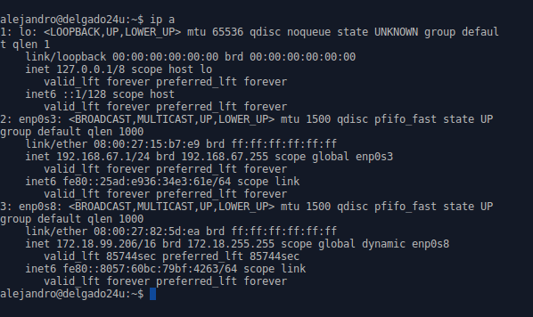
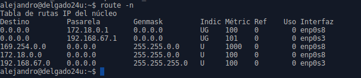
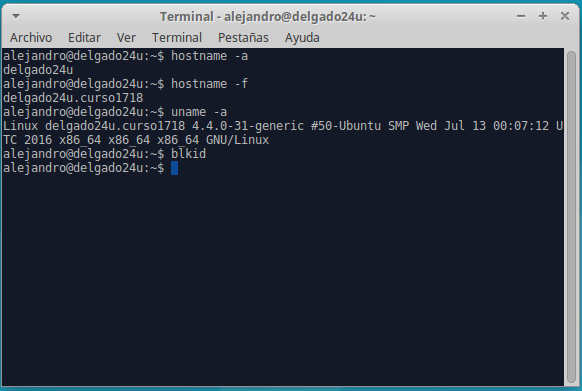
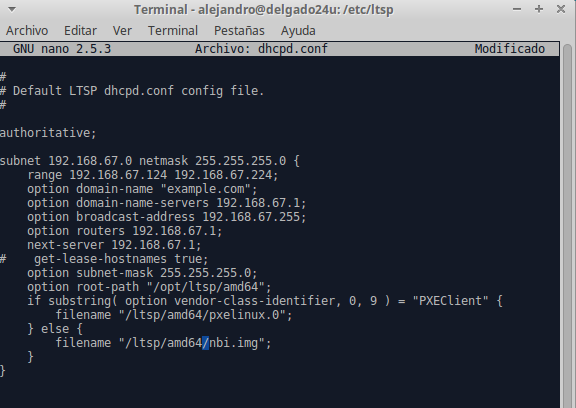

# Clientes ligeros con LTSP/Ubuntu

## Máquinas implicadas

* Máquina con Xubuntu y dos tarjetas de red, una interna y otra externa
* Máquina sin disco duro ni unidad óptica, únicamente una tarjeta de red y 1 GB de memoria RAM.

## Propósito de la práctica

Darle soporte a los equipos cliente sin ningún tipo de sistema operativo ni forma de instalarlo físicamente desde un servidor Ubuntu situado en la misma red.

# Comenzando con la práctica

## En el servidor Xubuntu

* Configuración de las interfaces de red:

Como se puede observar, tenemos una "enp0s3" apuntando hacia una red interna y la segunda tarjeta "enp0s8" apuntando hacia fuera.

* Comprobaciones de la máquina

* Fichero Hosts, donde se refleja el nombre de dominio en Debian/Ubuntu

* Validación del usuario root en el servidor

* Permitir el logueo del root en ssh

* Creación de 3 usuarios locales usando PrimerApellido-Alumno1, PrimerApellido-Alumno2 ... (usando el comando adduser)

* Instalación del sevidor de clientes ligeros "apt-get install ltsp-server-standalone"

* Información de la imagen del sistema creada con el comando "ltsp-build-client"

* Fichero de configuración del servicio DHCP del servidor de clientes ligeros (donde en la ruta de los ficheros cambiamos i386 por amd64)

* Comprobación de que el servicio DHCP funciona perfectamente en el servidor

## Máquina cliente (Xubuntu)

* Antes de iniciar la máquina, en las "opciones de arranque" que nos ofrece VBox señalamos que sea por red

* Nada más arrancar la máquina, empezará a contactar con el servidor DHCP del LTSP

* Aquí ya lo ha encontrado, por lo que empieza a cargar la imagen que se encuentra en el servidor LTSP

* Y bueno, carga la imagen... con un cierto bug del que aún no conocemos la fuente

