# Conexiones remotas con VNC

## Máquinas implicadas

* Dos máquinas con GNU/Linux OpenSUSE, una que haga de cliente y otra de servidor.

    

* Dos máquinas con Windows 7, una que haga de cliente y otra de servidor.

## Propósito de la práctica

Instalar el servicio de acceso a escritorio remoto VNC y comprobar que se pueden efectuar las siguientes conexiones:

* Acceder a Windows - desde Windows 7
* Acceder a Windows - desde GNU/Linux OpenSUSE
* Acceder a GNU/Linux OpenSUSE - desde GNU/Linux OpenSUSE
* Acceder a GNU/Linux OpenSUSE - desde Windows 7

# Comenzando con la práctica

## Instalación VNC en Windows

Para esta prarte de la práctica es necesario la descarga del programa "tightVNC", solo que de esa descarga seleccionaremos los servicios necesarios para cliente y para servidor.

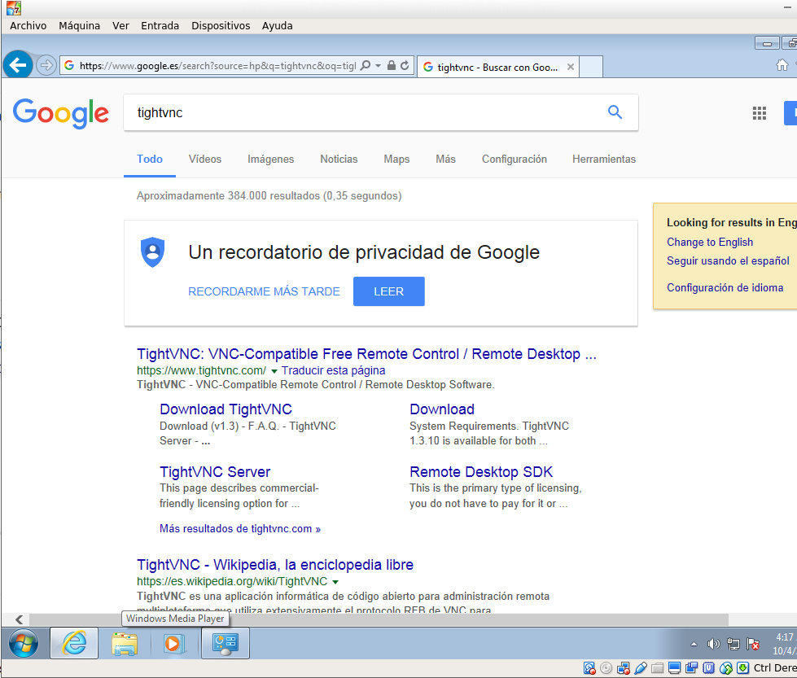

### En el servidor

* Tenemos el programa descargado, así que entramos en el asistente

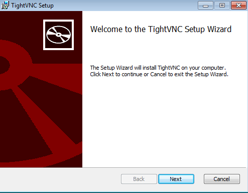

* En el siguiente pantallazo elegimos la opción "Custom"

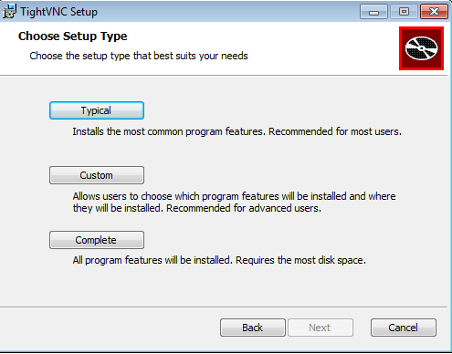

* Ahí es donde seleccionaremos que se instale unicamente el servidor y no el cliente VNC. Lo siguiente a esto será simplemente esperar a que se instale.

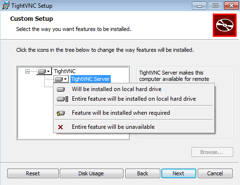

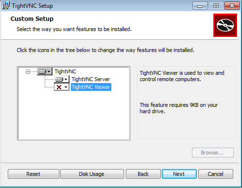

* Debemos especificar cuales seran las claves para autenticar la conexion remota, algo que nos pedirá antes de acabar la propia instalación.

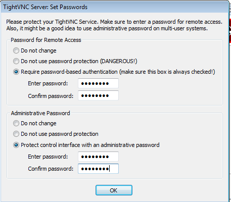

* Acto seguido termina la propia instalación.

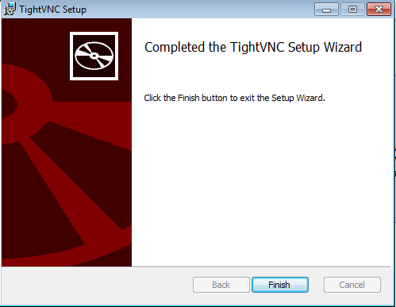

### En el cliente

* Realizamos justo el mismo proceso, sólo que instalando únicamente el cliente VNCviewer.

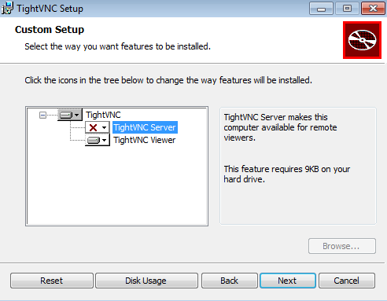

* Y ya tendríamos el cliente listo.

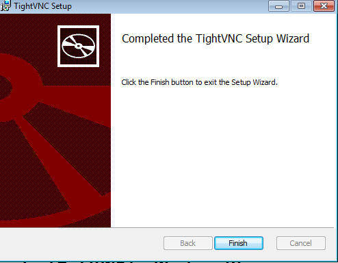

## Intalación VNC en Linux

### En el servidor

* El servicio VNC viene directamente instalado por defecto en OpenSUSE, por lo que lo único que tenemos que hacer es configurarlo.

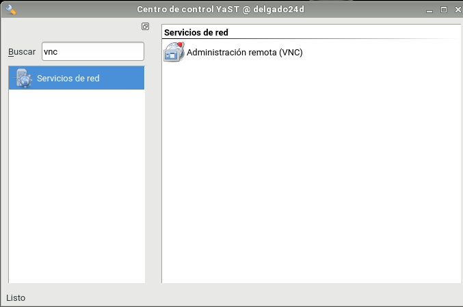

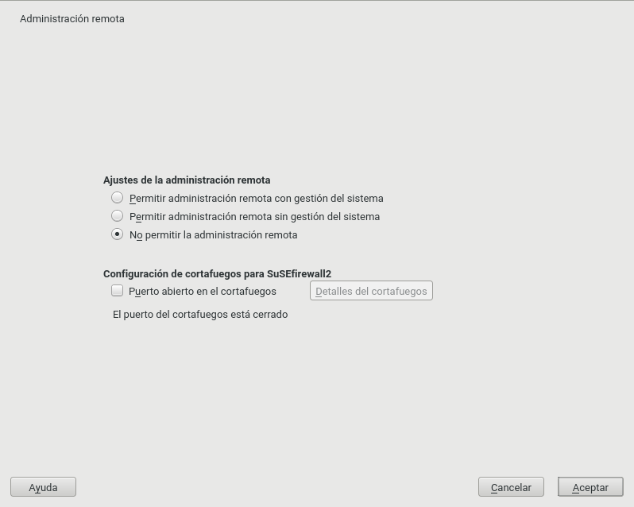

* Teniendo la pantalla anterior, seleccionamos las siguientes opciones.

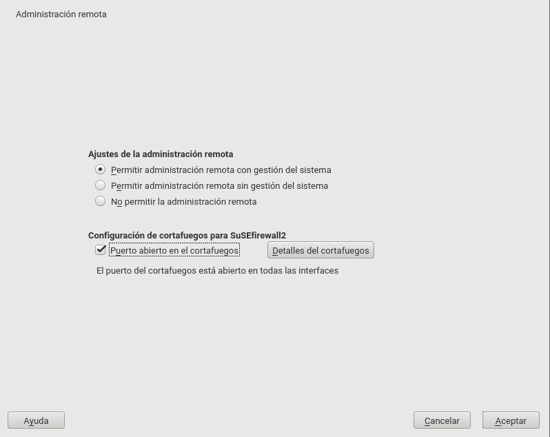

* Luego nos pedirá la instalación del siguiente paquete.

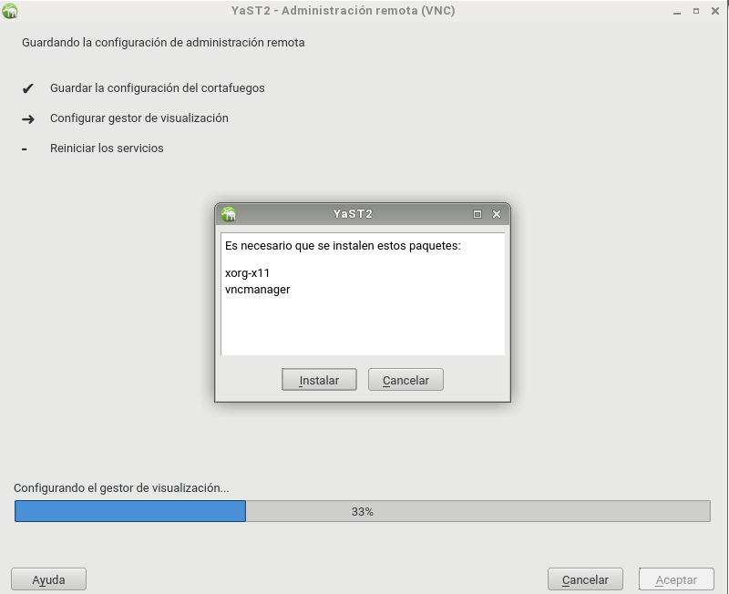

* Una vez instalado, vamos a la consola y ejecutamos "vncserver".
Una vez ejecutado, nos preguntará acerca de las contraseñas que le pondremos a la conexión remota. Después de realizar esto, nos saldrá la siguiente información:

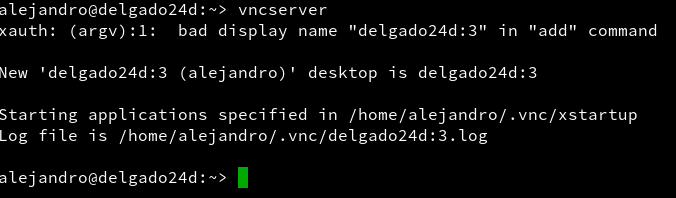

(Se trata de la explicación del puerto que el servidor ha asignado para la conexión)

## Conexiones Cliente-Servidor

### Linux-Linux

* Utilizando este detalle de la anterior captura:

* Nos vamos al cliente para iniciar la conexión remota. Para ello ponemos la IP y el puerto designado.

* A continuación ponemos la contraseña que hayamos definido en el servidor.

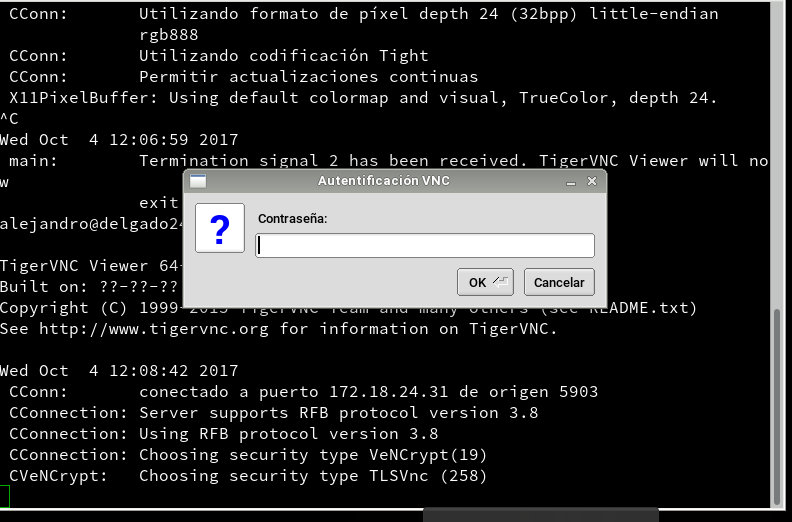

* Y de esta forma establecemos la conexión.

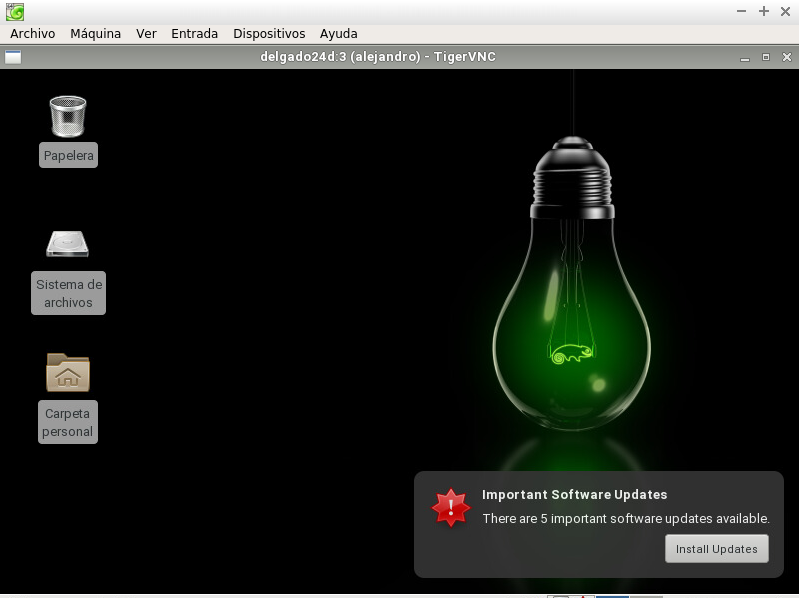

* Comprobación de la conexión:

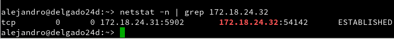

### Windows-Windows

* Primero entramos en el equipo servidor, donde configuraremos el puerto que queremos para que se realice la conexión. Nos pide contraseña.

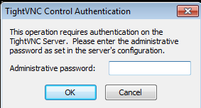

* Este es el panel de control del servidor VNC.

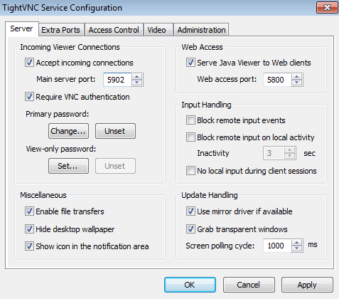

* Luego en el equipo cliente abrimos el cliente VNC, en el cual pondremos la dirección del equipo servidor junto con el puerto anteriormente designado.

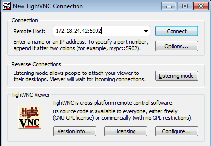

* Acto seguido nos pide contraseña

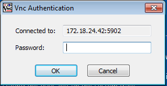

* Y hacemos conexión. Aquí esta la comprobación.

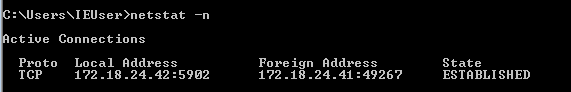

### Linux-Windows

* Buscamos la conexión del servidor Windows con su puerto.

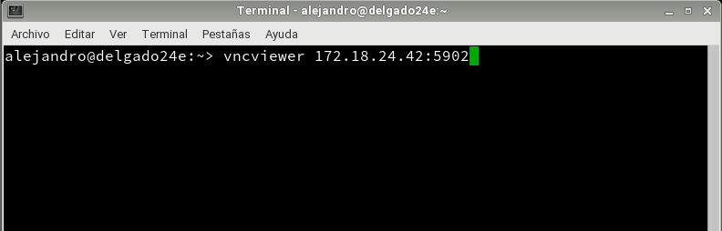

* Colocamos la contraseña asignada en el servidor Windows.

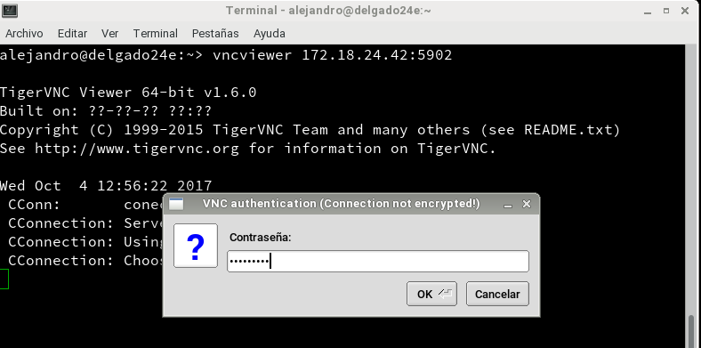

* Conexión realizada con su comprobación.

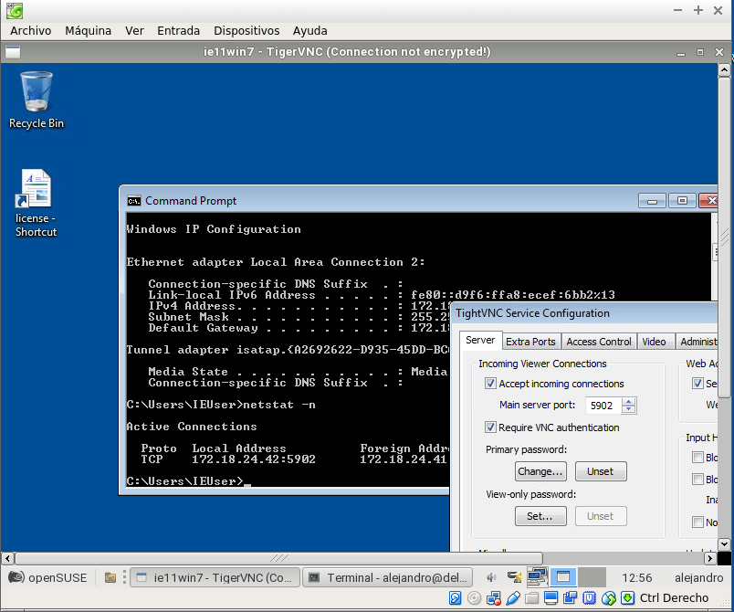

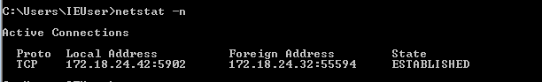

### Windows-Linux

* Desde el cliente Windows introducimos de nuevo la IP del servidor Linux y su puerto.

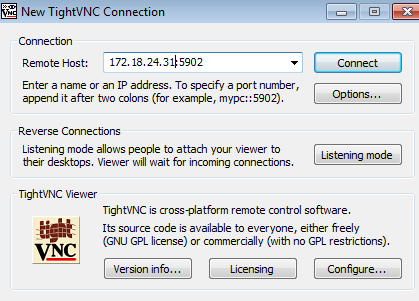

* Ponemos la contraseña.

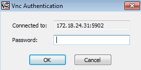

* Conexión realizada con su comprobación.

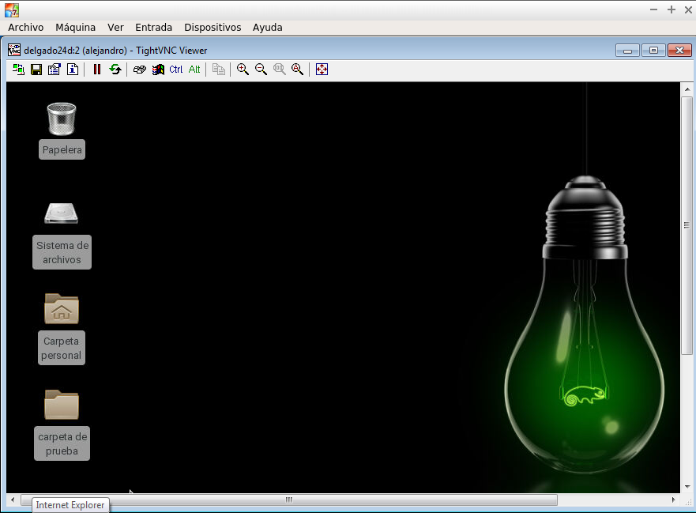

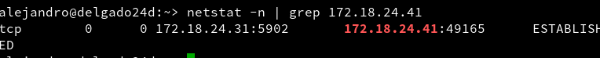
