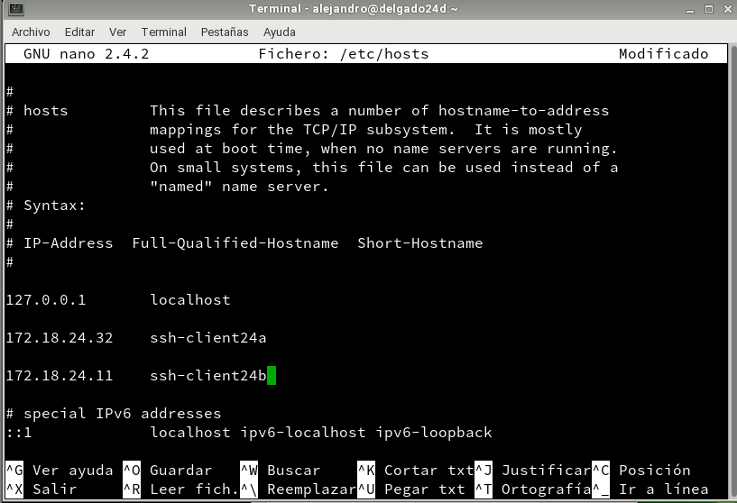
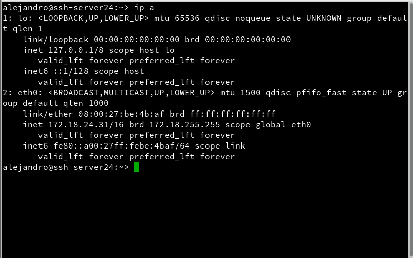
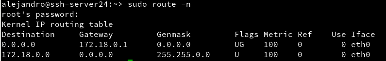
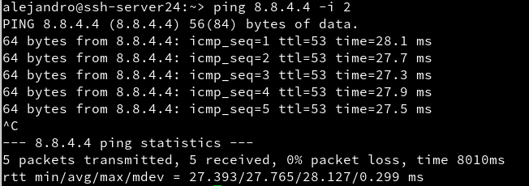
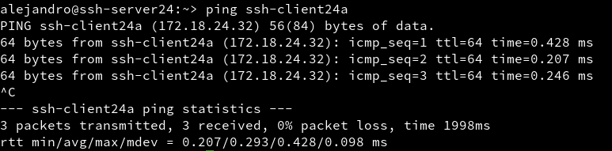
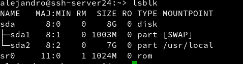
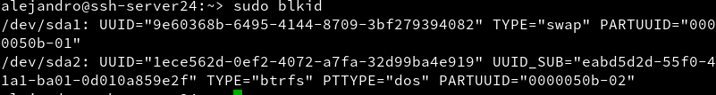
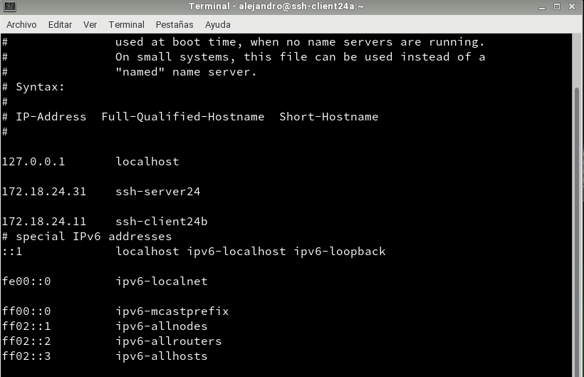
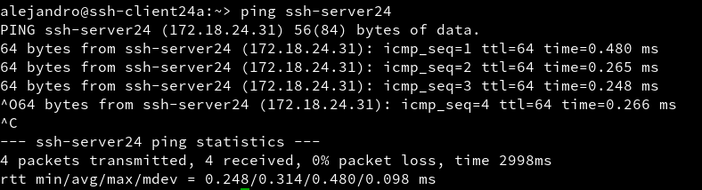
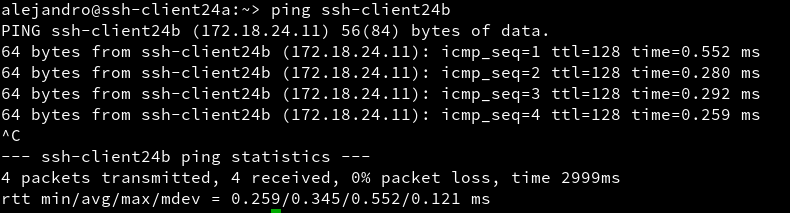

# Acceso remoto SSH

## Máquinas implicadas
* Dos máquinas con GNU/Linux OpenSUSE, una cliente (172.18.24.32/ssh-client24a) y otra que haga de servidor (172.18.24.31/ssh-server24)

* Una máquina Windows 7 que haga de cliente (172.18.24.11/ssh-client24b)

## Propósito de la práctica

Realizar algunos ejercicios tales como la ejecución de programas en remoto o la modificación de claves públicas para entender mejor el funcionamiento del servicio ssh.

# 1. Preparativos

## 1.1 Servidor ssh

* Configurar el servidor GNU/Linux con siguientes valores:
  * SO GNU/Linux: OpenSUSE
  * IP estática: 172.18.24.31
  * Nombre de equipo: ssh-server24

* Añadir en /etc/hosts los equipos ssh-client24a y ssh-client24b

* Comprobaciones.

  * ip a
  

  * route -n
  

  * ping 8.8.4.4 -i 2
  

  * host www.google.es
  

  * ping ssh-client24a
  

  * ping ssh-client24b
  

  * lsblk
  

  * blkid
  

* Crear los siguientes usuarios en ssh-server24:

## 1.2 Cliente GNU/Linux

* Configurar el cliente1 GNU/Linux con los siguientes valores:
  * SO OpenSUSE
  * IP estática 172.18.24.32
  * Nombre de equipo: ssh-client24a

* Añadir en /etc/hosts el equipo ssh-server24, y ssh-client24b.

* Comprobar haciendo ping a ambos equipos.

## 1.3 Cliente Windows

* Instalar software cliente SSH en Windows. Para este ejemplo usaremos "PuTTY"

