# Acceso remoto SSH

## Máquinas implicadas
* Dos máquinas con GNU/Linux OpenSUSE, una cliente (172.18.24.32/ssh-client24a) y otra que haga de servidor (172.18.24.31/ssh-server24)

* Una máquina Windows 7 que haga de cliente (172.18.24.11/ssh-client24b)

## Propósito de la práctica

Realizar algunos ejercicios tales como la ejecución de programas en remoto o la modificación de claves públicas para entender mejor el funcionamiento del servicio ssh.

# 1. Preparativos

## 1.1 Servidor ssh

* Configurar el servidor GNU/Linux con siguientes valores:
  * SO GNU/Linux: OpenSUSE
  * IP estática: 172.18.24.31
  * Nombre de equipo: ssh-server24

* Añadir en /etc/hosts los equipos ssh-client24a y ssh-client24b

* Comprobaciones.

  * ip a

  

  * route -n

  

  * ping 8.8.4.4 -i 2

  

  * host www.google.es

  

  * ping ssh-client24a

  

  * ping ssh-client24b

  

  * lsblk

  

  * blkid

  

* Crear los siguientes usuarios en ssh-server24:

## 1.2 Cliente GNU/Linux

* Configurar el cliente1 GNU/Linux con los siguientes valores:
  * SO OpenSUSE
  * IP estática 172.18.24.32
  * Nombre de equipo: ssh-client24a

* Añadir en /etc/hosts el equipo ssh-server24, y ssh-client24b.

* Comprobar haciendo ping a ambos equipos.

## 1.3 Cliente Windows

* Instalar software cliente SSH en Windows. Para este ejemplo usaremos "PuTTY"

* SO Windows 7
* IP estática 172.18.24.11
* Nombre de equipo: ssh-client24b
* Añadir en `C:\Windows\System32\drivers\etc\hosts` el equipo ssh-server24 y ssh-client24a.

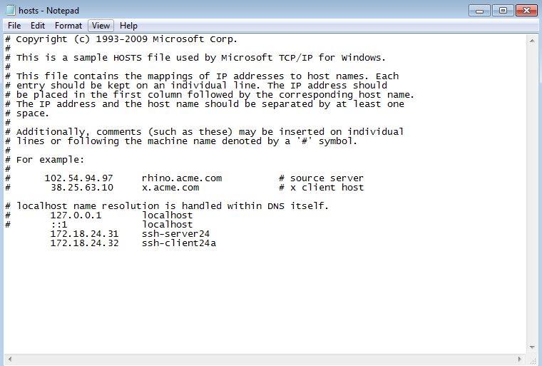

* Comprobar haciendo ping a ambos equipos

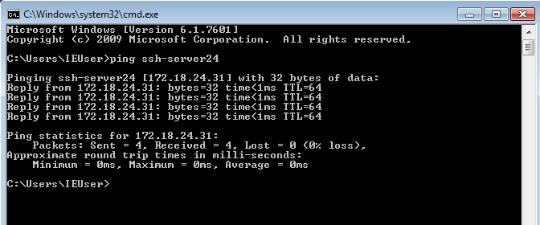

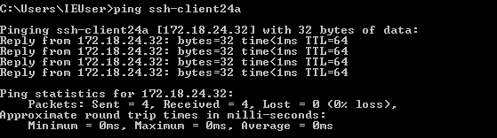

# 2. Instalación del servicio SSH

* Instalar el servicio SSH en la máquina ssh-server

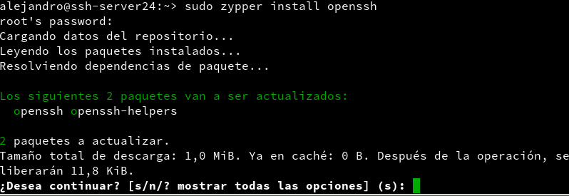

## 2.1 Comprobación

* Desde el propio ssh-server, verificar que el servicio está en ejecución

  * `systemctl status sshd`, esta es la forma de comprobarlo en systemd

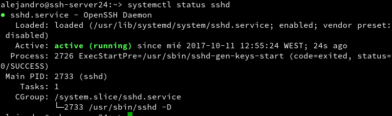  

* `netstat -ntap`: Comprobar que el servicio está escuchando por el puerto 22

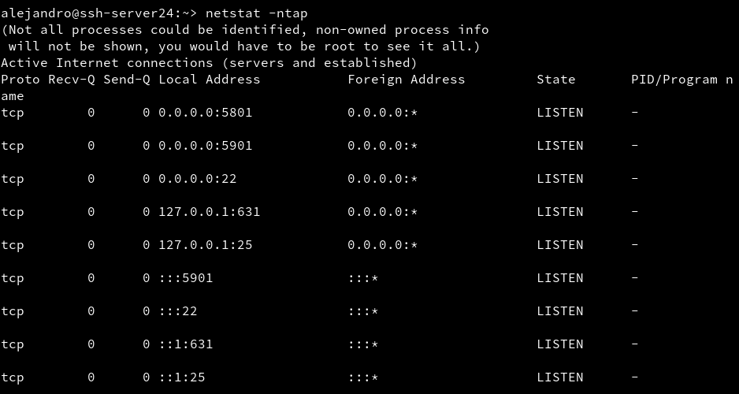  

## 2.2 Primera conexión SSH desde cliente GNU/Linux

* Comprobamos la conectividad con el servidor desde el cliente con `ping ssh-serverXX`

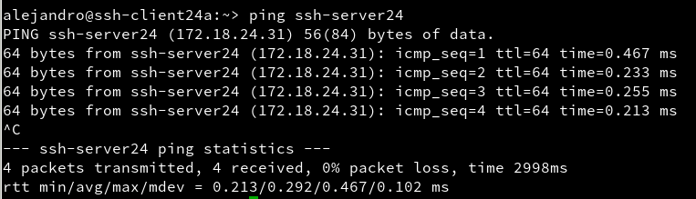

* Desde el cliente comprobamos que el servicio SSH es visible con `nmap -Pn ssh-serverXX`. Debe mostrarnos que el puerto 22 está abierto. Esto es, debe aparecer una línea como "22/tcp open ssh"

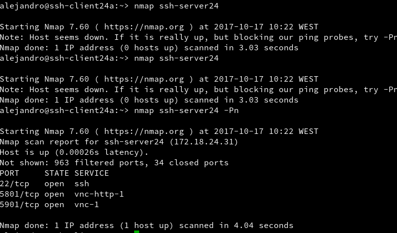

* Desde el cliente GNU/Linux nos conectamos mediante `ssh 1er-apellido-alumno1@ssh-server`. Capturar imagen del intercambio de claves que se produce en el primer proceso de conexión SSH

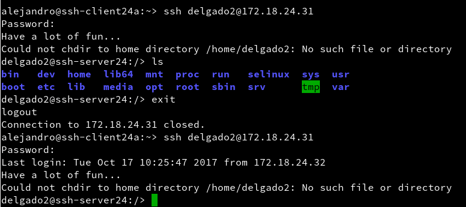

* Comprobar contenido del fichero `$HOME/.ssh/known_hosts` en el equipo ssh-client1. OJO si el prompt pone ssh-server están el el servidor, y si pone ssh-client1 están el el cliente1.

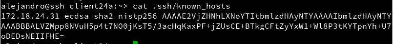

## 2.3 Primera conexión SSH desde cliente Windows

* Desde el cliente Windows nos conectamos usando `PuTTY`. Capturar imagen del intercambio de claves que se produce en el primer proceso de conexión SSH.

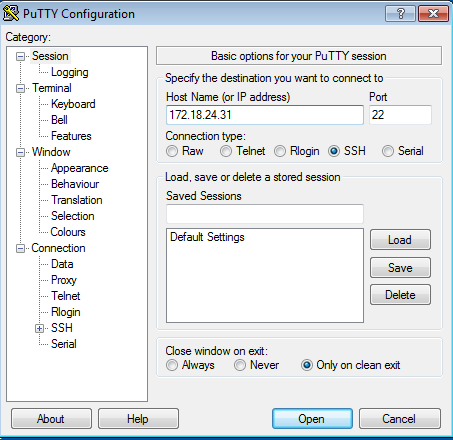

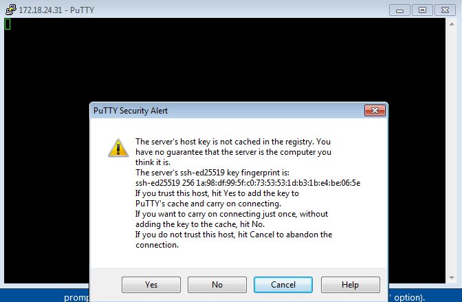

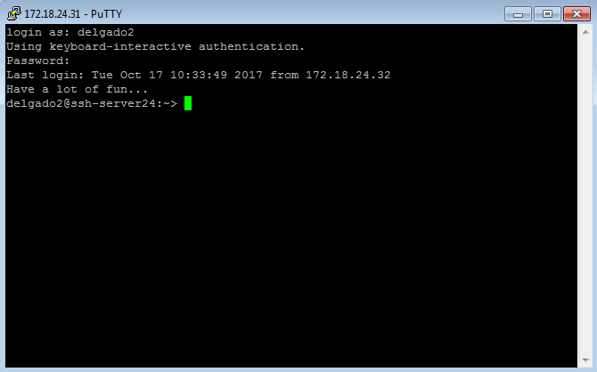

# 3. ¿Y si cambiamos las claves del servidor?

* Confirmar que existen los siguientes ficheros en `/etc/ssh`, Los ficheros `ssh_host*key` y `ssh_host*key.pub`, son ficheros de clave pública/privada que identifican a nuestro servidor frente a nuestros clientes:

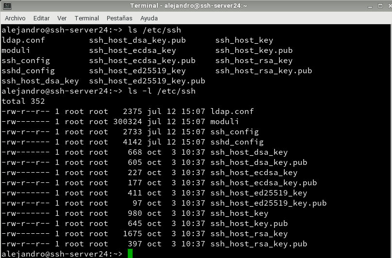

* Modificar el fichero de configuración SSH `(/etc/ssh/sshd_config)` para dejar una única línea: `HostKey /etc/ssh/ssh_host_rsa_key`. Comentar el resto de líneas con configuración HostKey. Este parámetro define los ficheros de clave publica/privada que van a identificar a nuestro servidor. Con este cambio decimos que sólo vamos a usar las claves del tipo RSA.

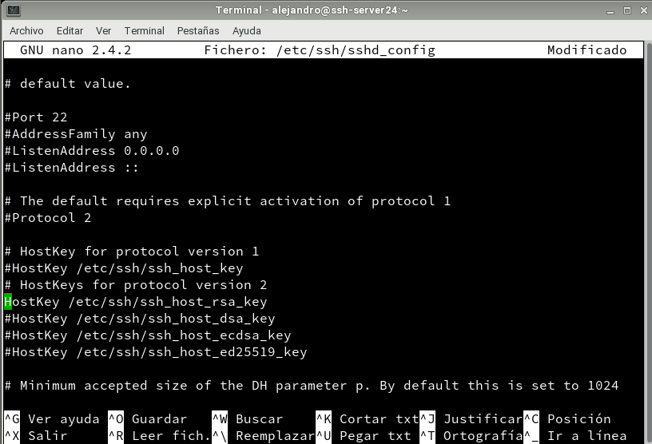

## 3.1 Regenerar certificados

Vamos a cambiar o volver a generar nuevas claves públicas/privadas para la identificación de nuestro servidor.

* En ssh-serverXX, como usuario root ejecutamos: `ssh-keygen -t rsa -f /etc/ssh/ssh_host_rsa_key`

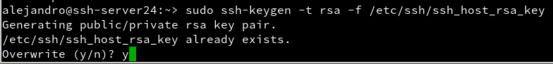

* No poner password al certificado de la máquina

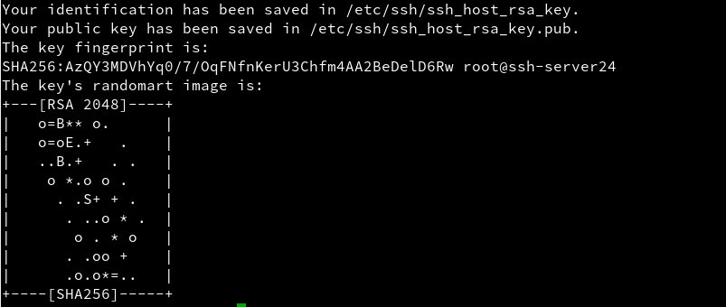

* Reiniciar el servicio SSH: `systemctl restart sshd` y comprobar que el servicio está en ejecución correctamente: `systemctl status sshd`

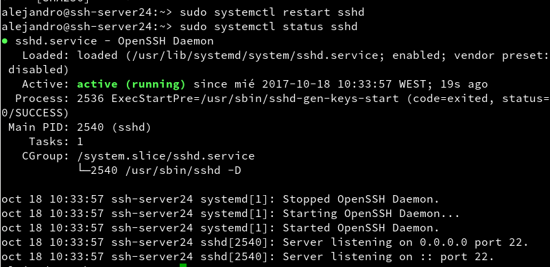

## 3.2 Comprobamos

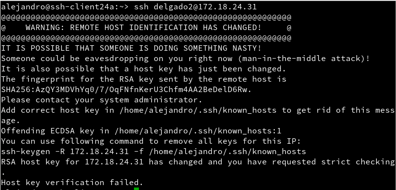

# 4 Personalización del prompt Bash

* Por ejemplo, podemos añadir las siguientes líneas al fichero de configuración del usuario1 en la máquina servidor (`Fichero /home/1er-apellido-alumno1/.bashrc`)

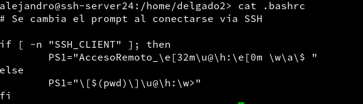

* Además, crear el fichero el fichero `/home/1er-apellido-alumno1/.alias`, donde pondremos el siguiente contenido:

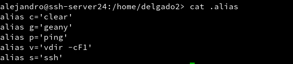

* Comprobar funcionamiento de la conexión SSH desde cada cliente.

### Linux
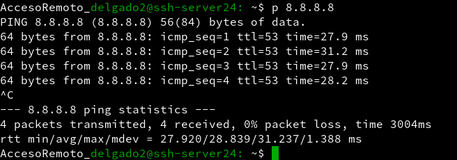

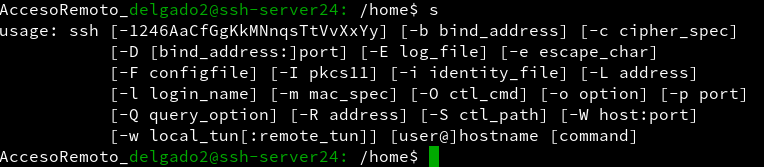

### Windows

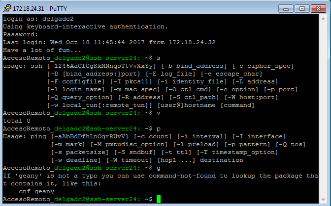

# 5. Autenticación mediante claves públicas

El objetivo de este apartado es el de configurar SSH para poder acceder desde el cliente1, usando el 1er-apellido-alumno4 sin poner password, pero usando claves pública/privada.

Para ello, vamos a configurar la autenticación mediante clave pública para acceder con nuestro usuario personal desde el equipo cliente al servidor con el usuario 1er-apellido-alumno4.

* Vamos a la máquina ss-clientXXa

* Iniciamos sesión con nuestro usuario nombre-alumno de la máquina ssh-client24a

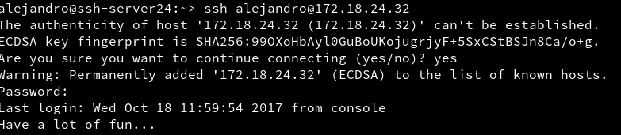

* Ejecutamos `ssh-keygen -t rsa` para generar un nuevo par de claves para el usuario en `/home/nuestro-usuario/.ssh/id_rsa` y `/home/nuestro-usuario/.ssh/id_rsa.pub`

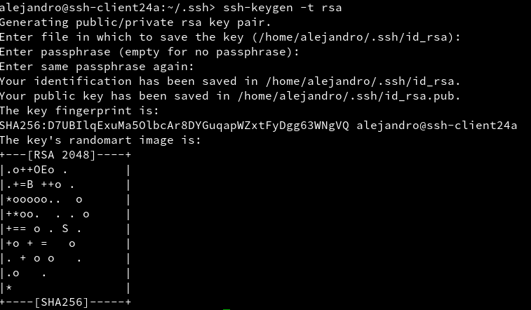

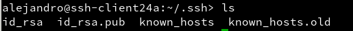

Ahora vamos a copiar la clave pública (id_rsa.pub) del usuario (nombre-de-alumno) de la máquina cliente, al fichero "authorized_keys" del usuario remoto 1er-apellido-alumno4 (que está definido en el servidor.

* Una forma de hacerlo sería usando el programa de copia segura `scp`

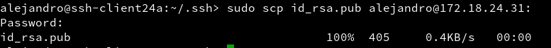

* Comprobar que ahora al acceder remotamente vía SSH

  * Desde ssh-client24a, NO se pide password

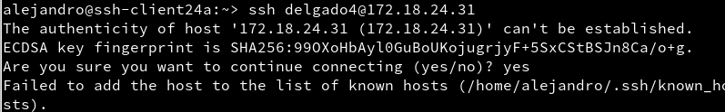    

  * Desde ssh-client24b, SI se pide el password

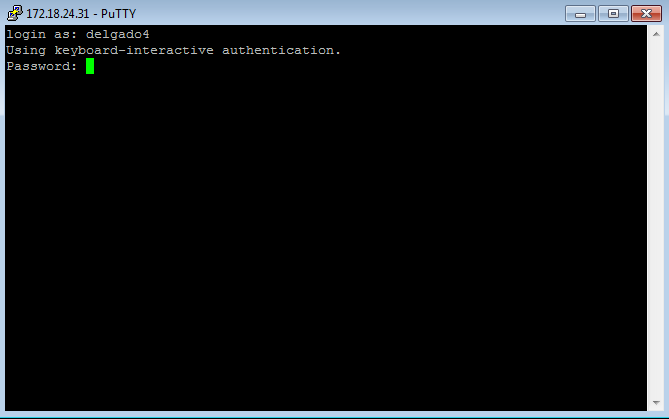

# 6. Uso de SSH como túnel para X

* Instalar en el servidor una aplicación de entorno gráfico (APP1) que no esté en los clientes. Por ejemplo Geany. Si estuviera en el cliente entonces buscar otra aplicación o desinstalarla en el cliente

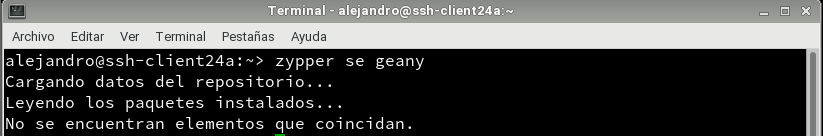

* Modificar servidor SSH para permitir la ejecución de aplicaciones gráficas, desde los clientes. Consultar fichero de configuración `/etc/ssh/sshd_config` (Opción `X11Forwarding yes`)

* Comprobar desde el clienteXXa, que funciona APP1(del servidor). Con el comando `ssh -X remoteuser1@ssh-server`, podemos conectarnos de forma remota al servidor, y ahora ejecutamos APP1 de forma remota

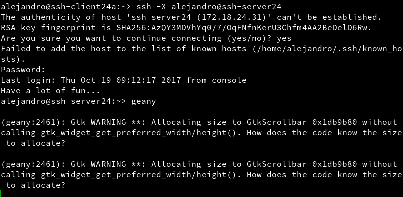

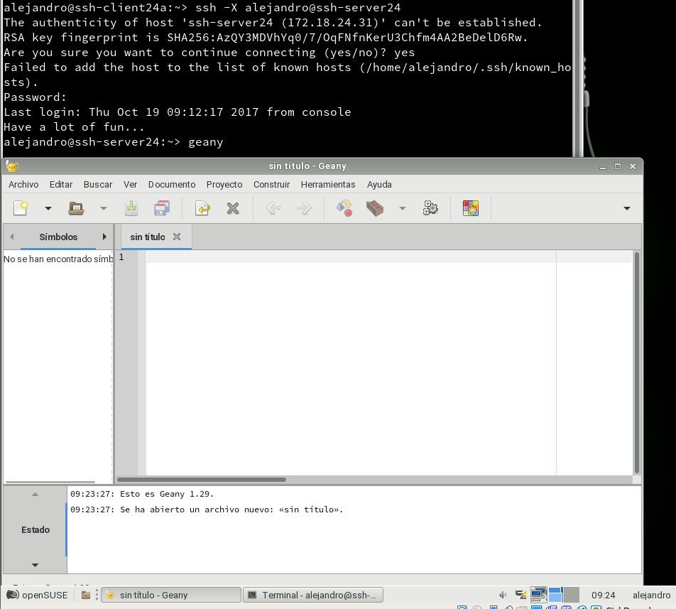

# 7. Aplicaciones Windows nativas

Podemos tener aplicaciones Windows nativas instaladas en ssh-server mediante el emulador WINE.

* Instalar emulador Wine en el ssh-server

* Ahora podríamos instalar alguna aplicación (APP2) de Windows en el servidor SSH usando el emulador Wine. O podemos usar el Block de Notas que viene con Wine: wine notepad

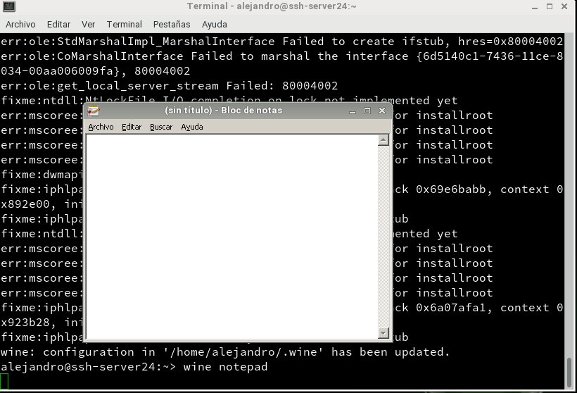

* Comprobar funcionamiento de APP2, accediendo desde ssh-client1

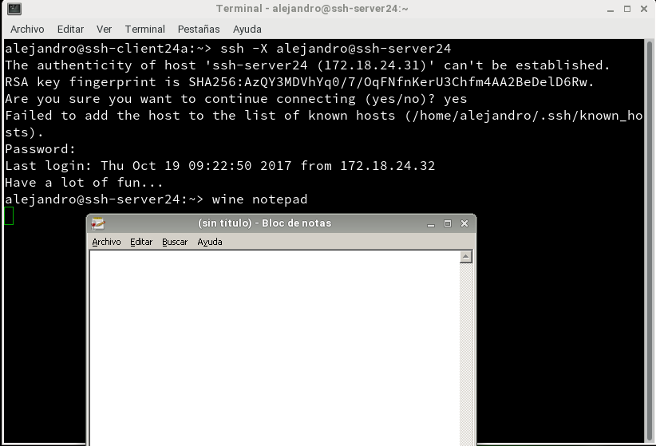

# 8. Restricciones de uso

Vamos a modificar los usuarios del servidor SSH para añadir algunas restricciones de uso del servicio.

## 8.1 Restricción sobre un usuario

* En el servidor tenemos el usuario remoteuser2 y remoteuser4. Desde local en el servidor podemos usar sin problemas el usuario

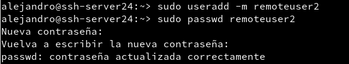

* Consultar/modificar fichero de configuración del servidor SSH (`/etc/ssh/sshd_config`) para restringir el acceso a determinados usuarios. Consultar las opciones `AllowUsers`, `DenyUsers`. Restringimos a remoteuser2 y dejamos a remoteuser4

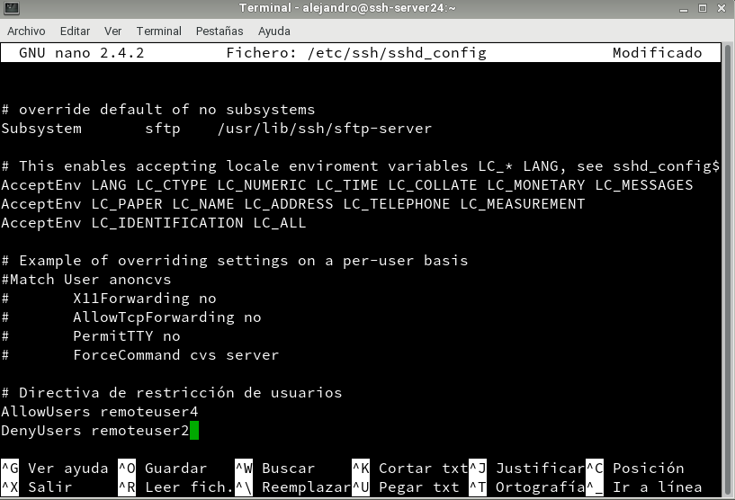

* Comprobarlo la restricción al acceder desde los clientes

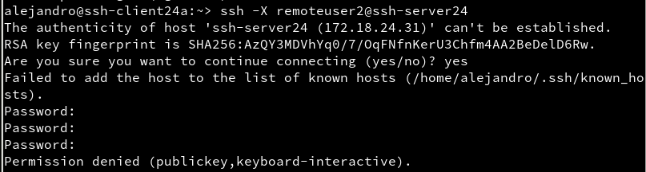

## 8.2 Restricción sobre una aplicación

* Crear grupo remoteapps

* Incluir al usuario remoteuser4 en el grupo remoteapps

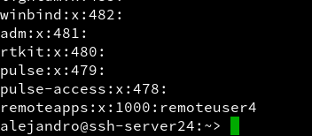

* Poner al programa APP1 el grupo propietario a remoteapps

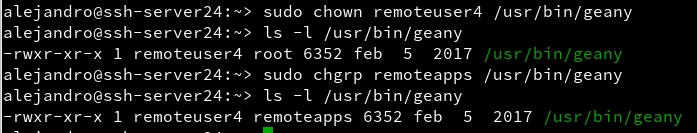

* Poner los permisos del ejecutable de APP1 a 750. Para impedir que los usurios que no pertenezcan al grupo puedan ejecutar el programa

* Comprobamos el funcionamiento en el servidor

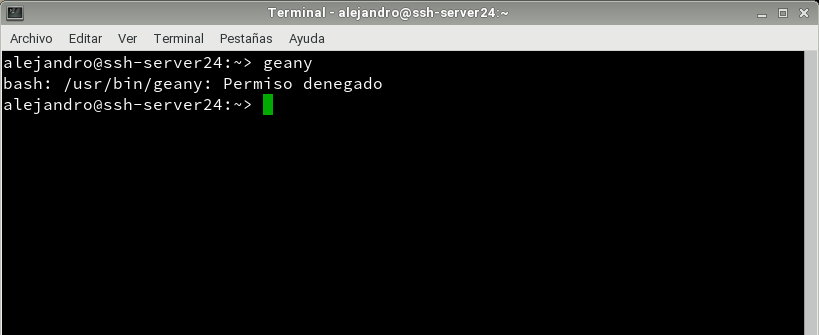

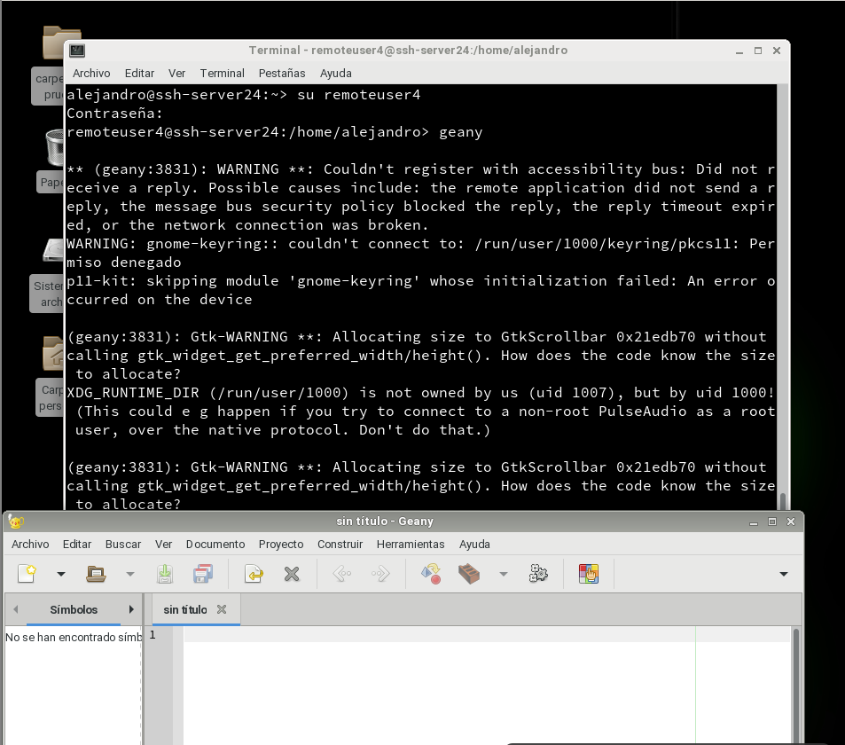

* Comprobamos el funcionamiento desde el cliente

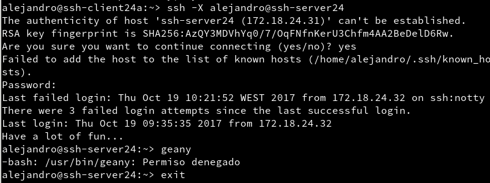

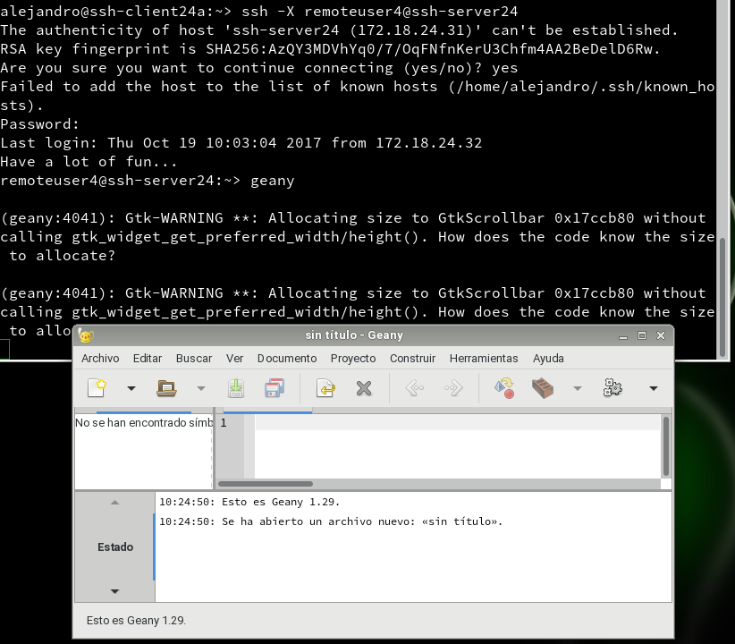
