# 1. Servidor LDAP - OpenSUSE

## 1.2 Instalación del Servidor LDAP

* Procedemos a la instalación del módulo Yast que sirve para gestionar el servidor LDAP (`yast2-auth-server`)

* Acto seguido; Ir a Yast -> Servidor de autenticación. Aparecerá como `Authentication Server`

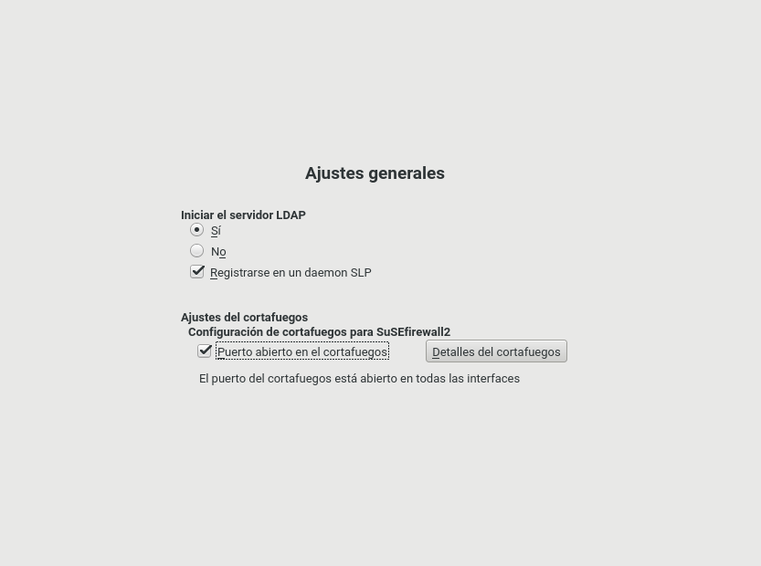

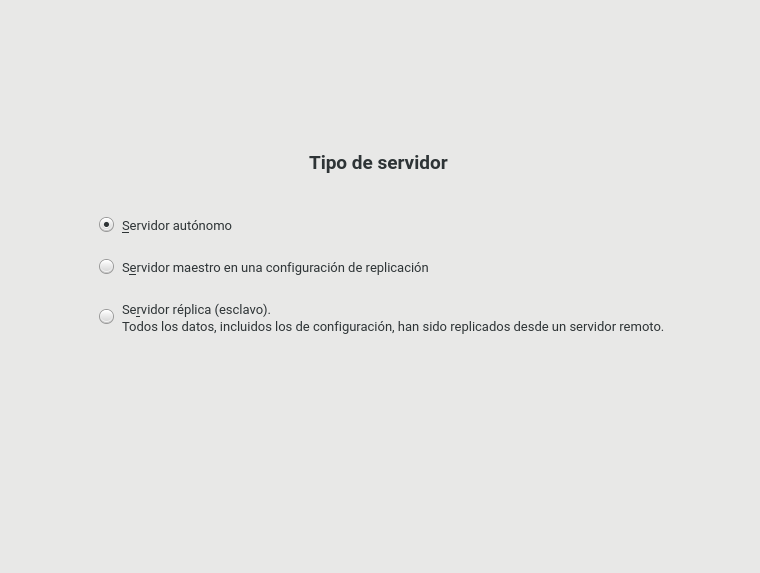

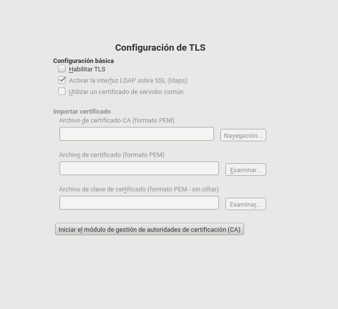

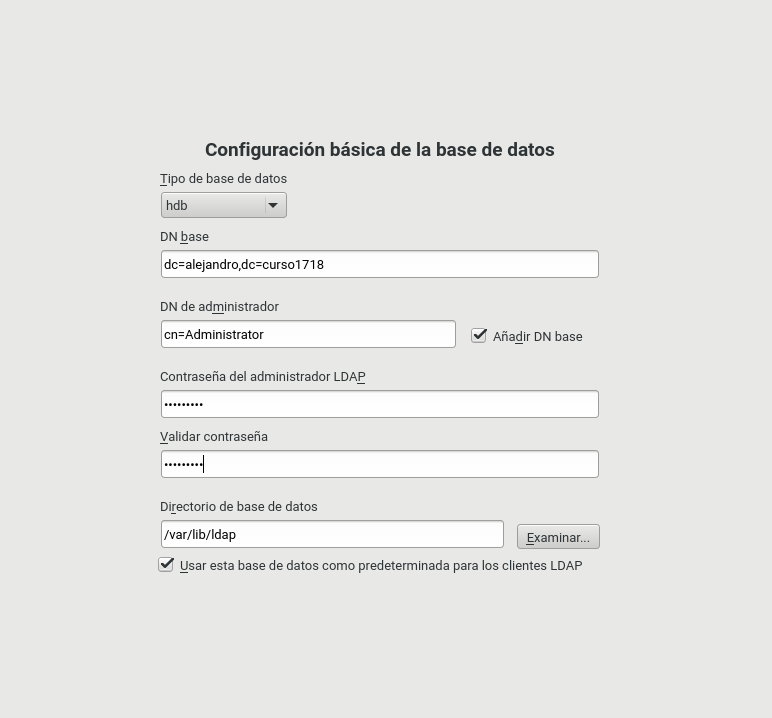

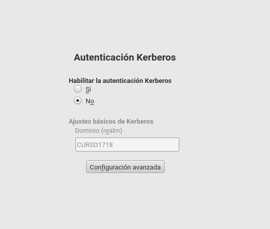

* Resumen de la configuración

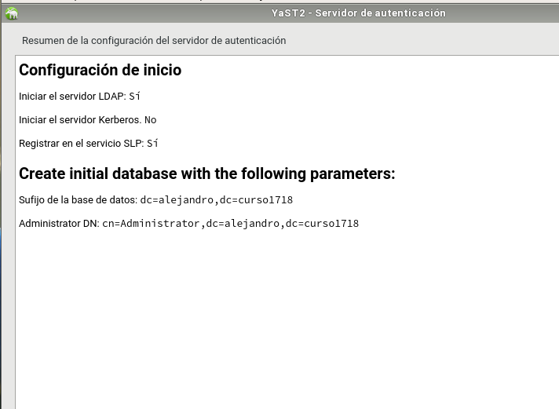

* Comprobaciones

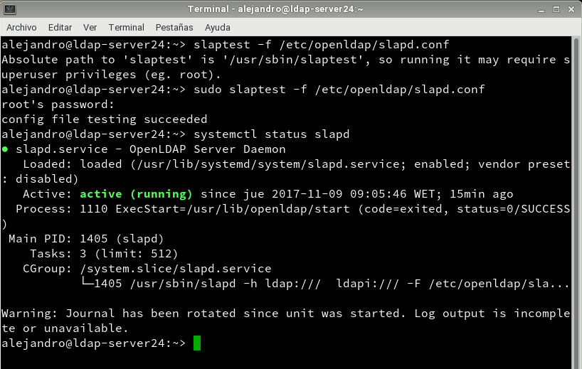

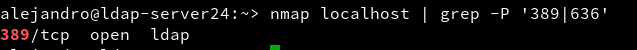

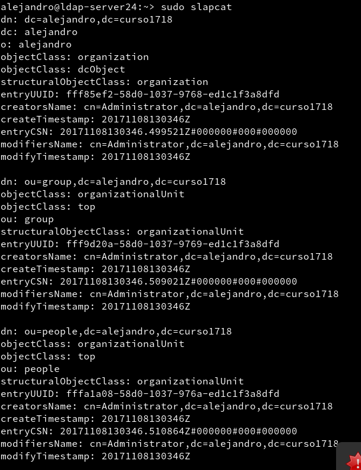

* Podemos comprobar el contenido de la base de datos LDAP usando la herramienta `gq`. Esta herramienta es un browser LDAP.

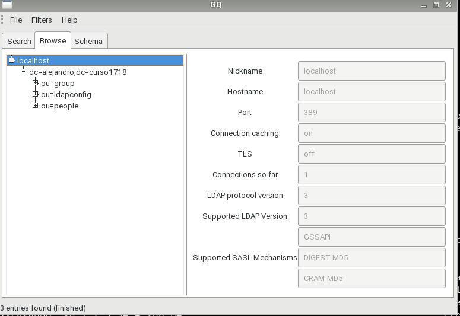

## 1.3 Crear usuarios y grupos LDAP

* Yast -> Usuarios Grupos -> Filtro -> LDAP

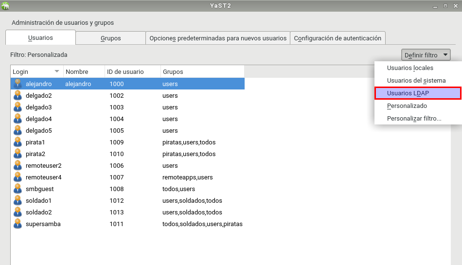

* Crear el grupo `piratas2` (Estos se crearán dentro de la `ou=groups`)

* Crear los usuarios `pirata21`, `pirata22` (Estos se crearán dentro de la `ou=people`)

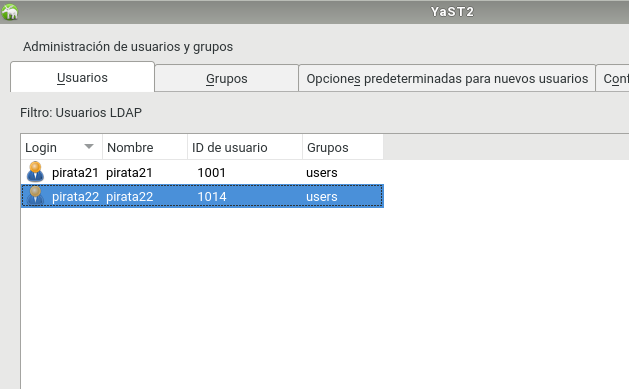

* Agregar los usuarios al grupo

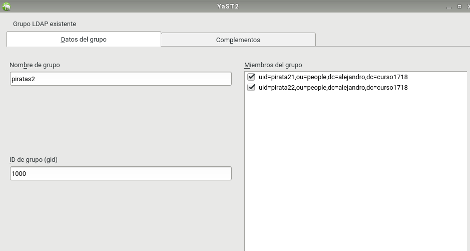

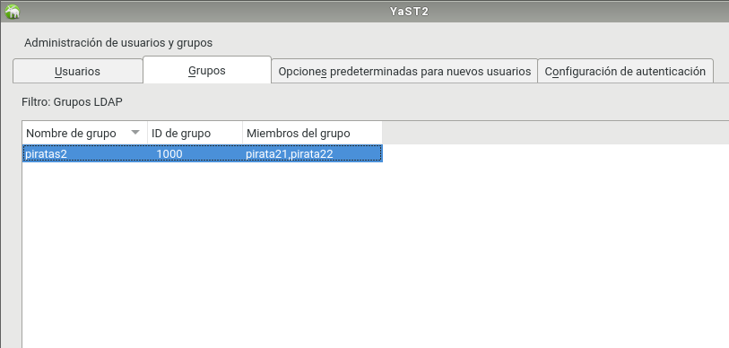

*  Usar `gq` para consultar/comprobar el contenido de la base de datos LDAP

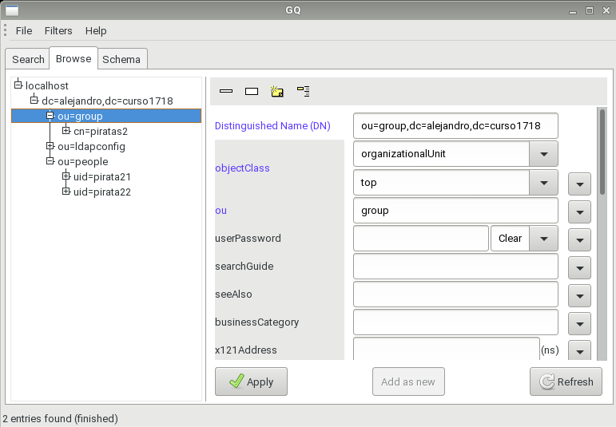

# 2. Cliente LDAP

## 2.1 Comprobación de la conexión cliente-servidor

* `nmap -Pn ldap-serverXX | grep -P '389|636'`, para comprobar que el servidor LDAP es accesible desde el cliente

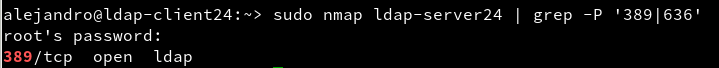

* Usar `gq` en el cliente para comprobar que se han creado bien los usuarios

[image](images/Selección_017.png)

[image](images/Selección_018.png)

## 2.2 Instalar cliente LDAP
