# Servidor de Impresión en Windows

# 1 Impresora compartida

## 1.1 Rol impresión

* En el servidor accedemos al `administrador del servidor` y abrimos la pestaña `administar`, en donde seleccionaremos `agregar roles y características`

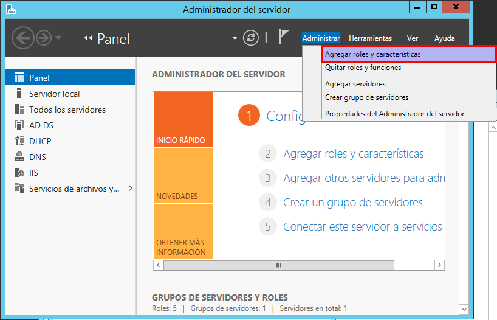

* Marcamos la opción `servicios de impresión y documentos`

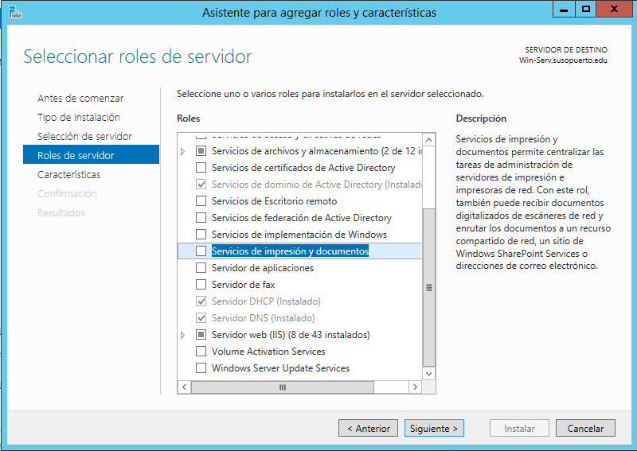

* Instalamos luego la característica `cliente de impresión en internet`

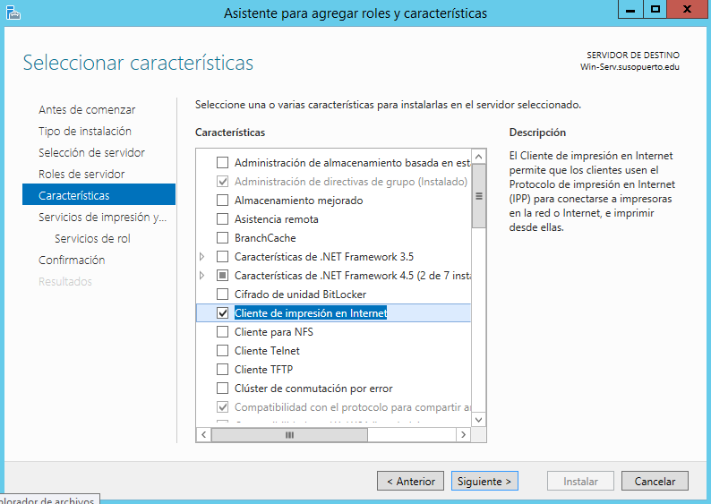

* Y marcamos la opción `impresión en internet`

* Ahora dejamos que instale las características

## 1.2 Instalar impresora PDF

* Como impresora PDF vamos a instalar el programa `PDF Creator`, que puede ser buscado en su versión gratuita en google.

* Una vez instalado, debemos acceder a `Perfiles -> Guardar -> Automático`. Ahí configuramos carpeta destino.

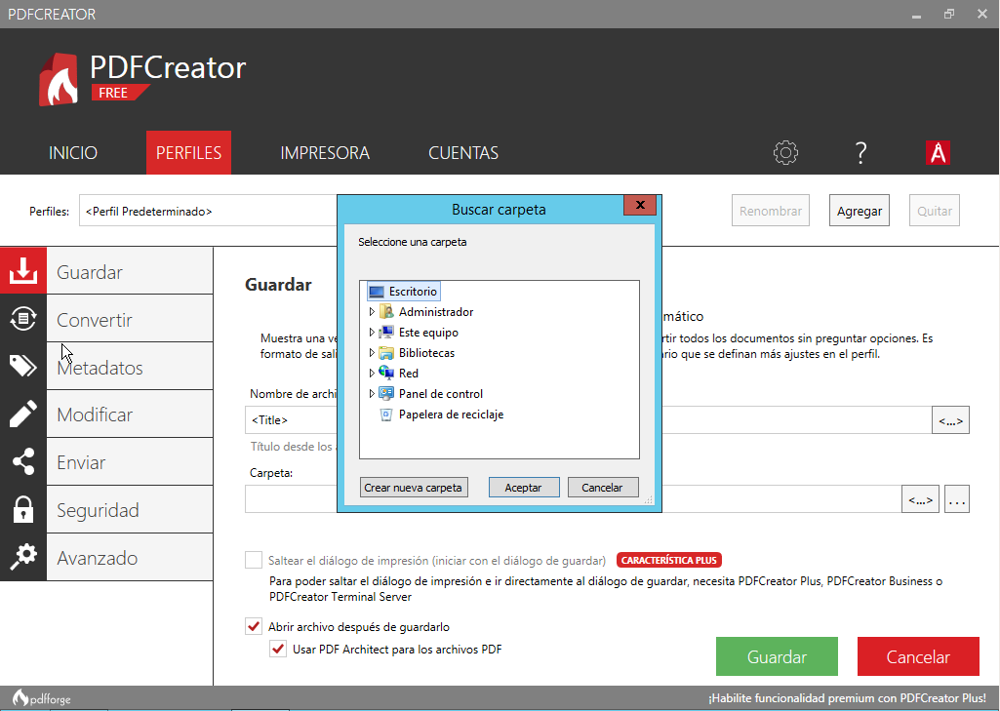

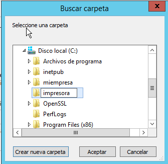

## 1.3 Probar la impresora en local

* Creamos un fichero sencillo de texto mediante el `bloc de notas`

* Cuando pulsemos `imprimir`, seleccionamos la impresora PDF que acabamos de instalar.

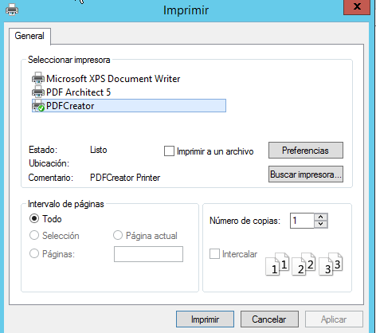

* Automáticamente `PDF Creator` nos preguntará sobre donde queremos guardarlo, entre otros parámetros.

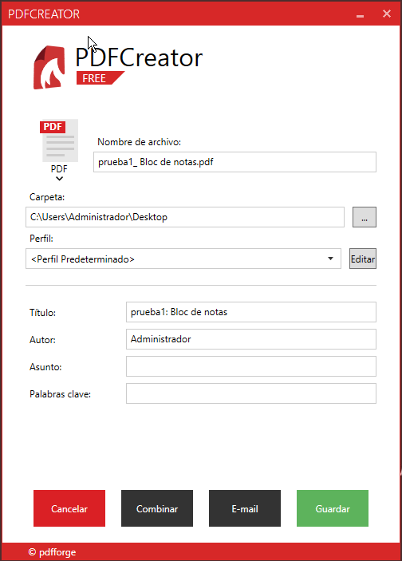

* Documento impreso por `PDF Creator`

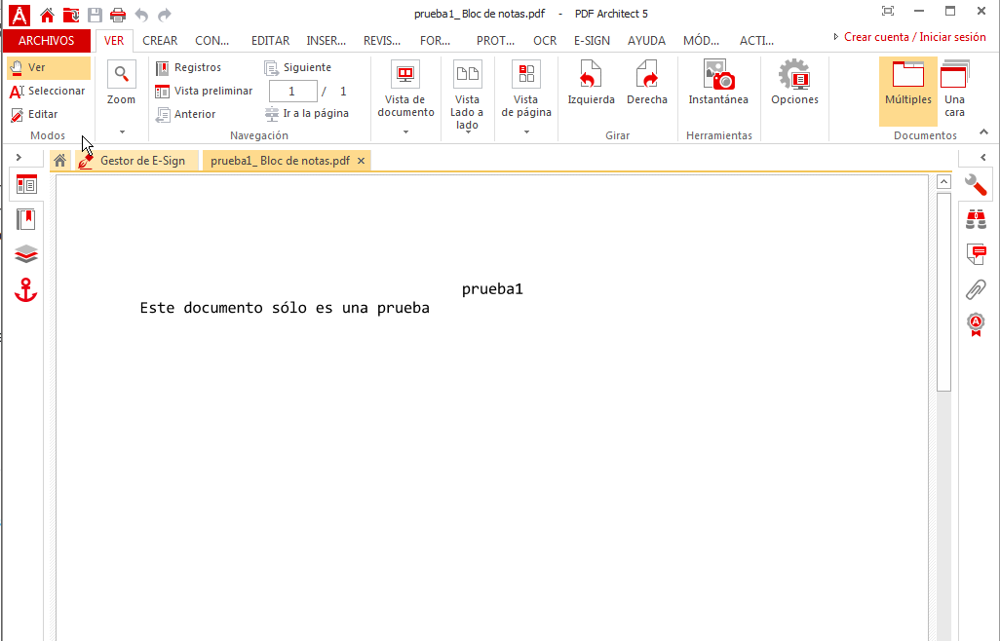

## 1.4 Compartir por red  

* Ahora vamos a configurar la impresora PDF como recurso compartido.

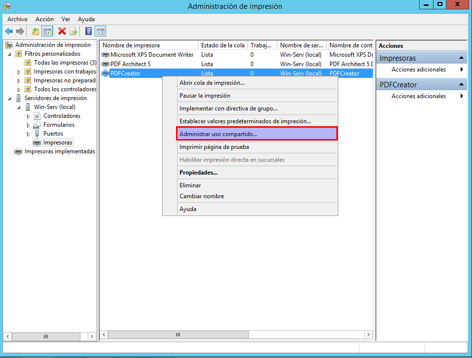

* Le ponemos el nombre de recurso que sea necesario.

* Luego en el cliente accedemos a los recursos compartidos del Servidor.

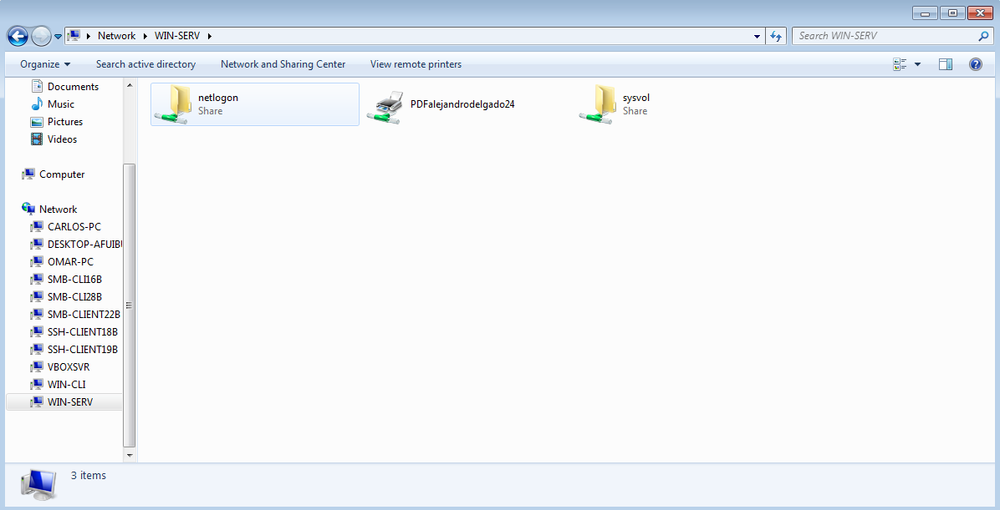

* Al tratar de acceder a la impresora, nos pedirá autenticación.

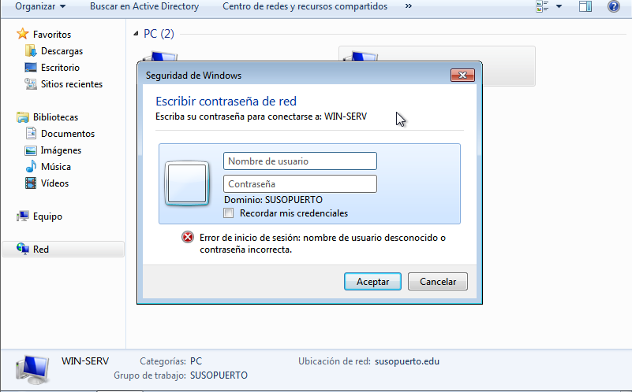

* Una vez validado, nos aparecerá el siguiente mensaje que nos avisa sobre la instalación de un controlador para la impresora remota dentro del cliente.

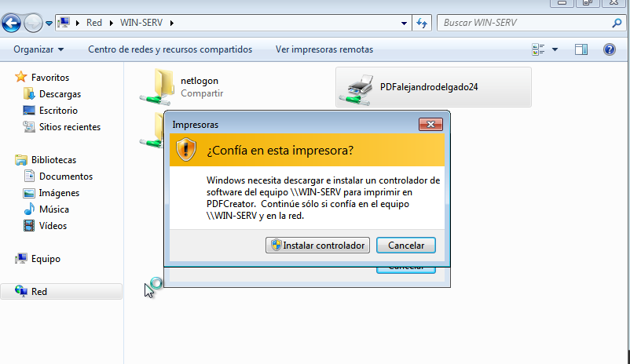

* Ahora ya tenemos el servicio listo desde el cliente.

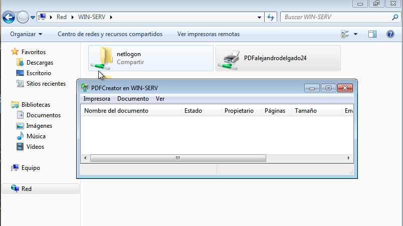

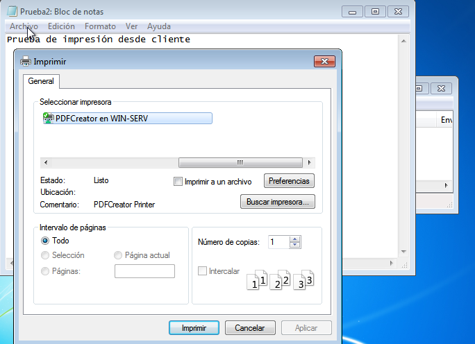

# 2 Acceso Web

## 2.1 Configurar impresión WEB

* Desde el cliente, abrimos el navegador e introducimos la url `http://<ip-del-servidor>/printers`

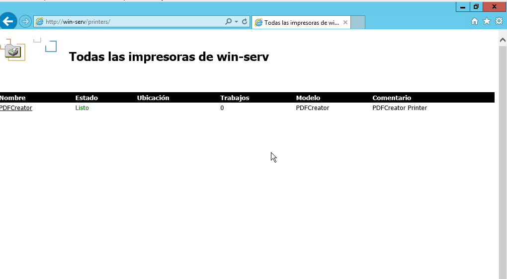

* Luego pinchamos en `propiedades`

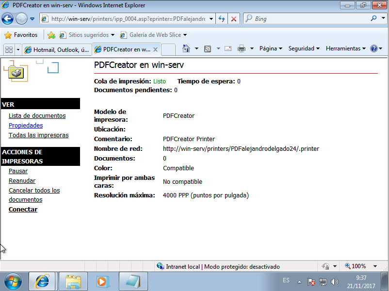

* Y luego pinchamos en `conectar` para unir la impresora al cliente.

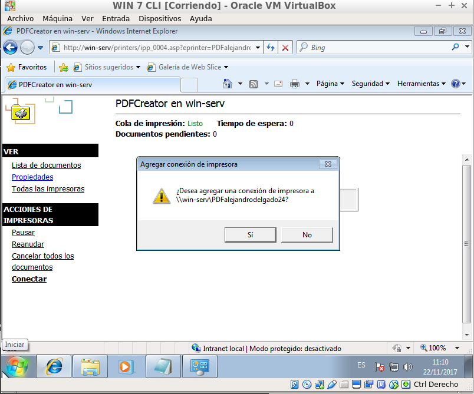

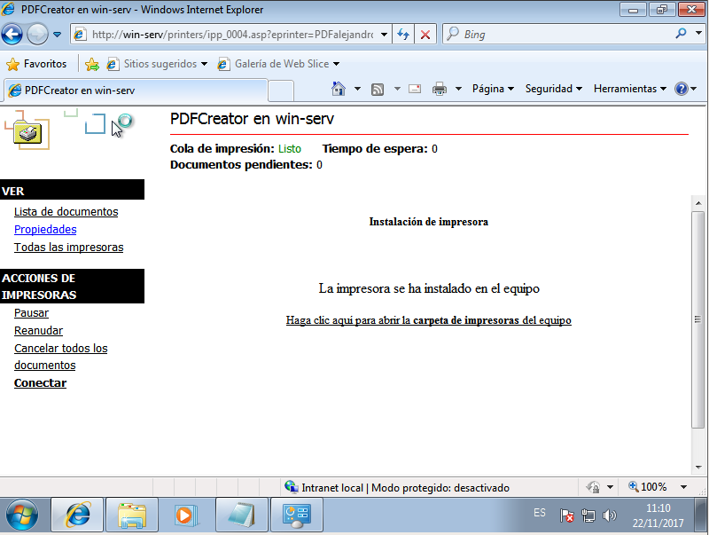

## 2.2 Comprobar desde el navegador

* Pausamos (a través del navegador haciendo click en la opción `pausar`) los trabajos de la impresora.

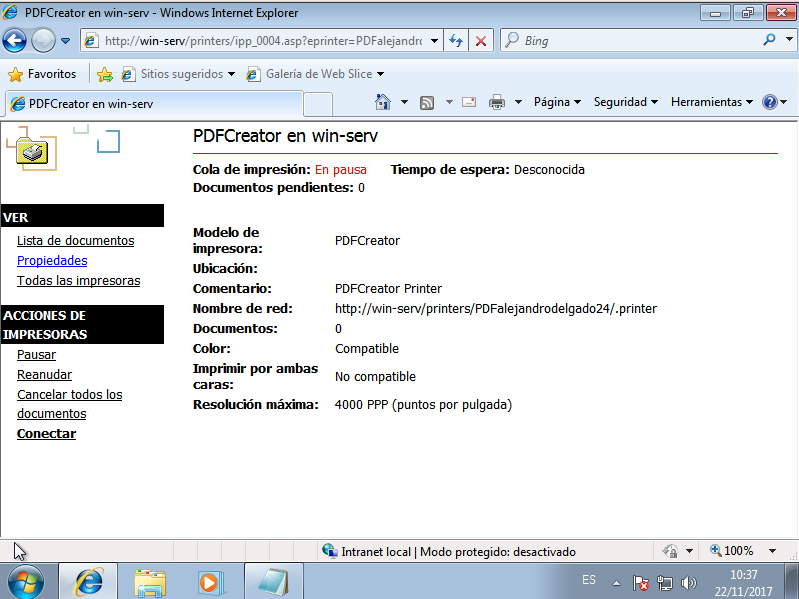

* Mandamos a imprimir algún documento, los cuales se quedarán en la cola de impresión.

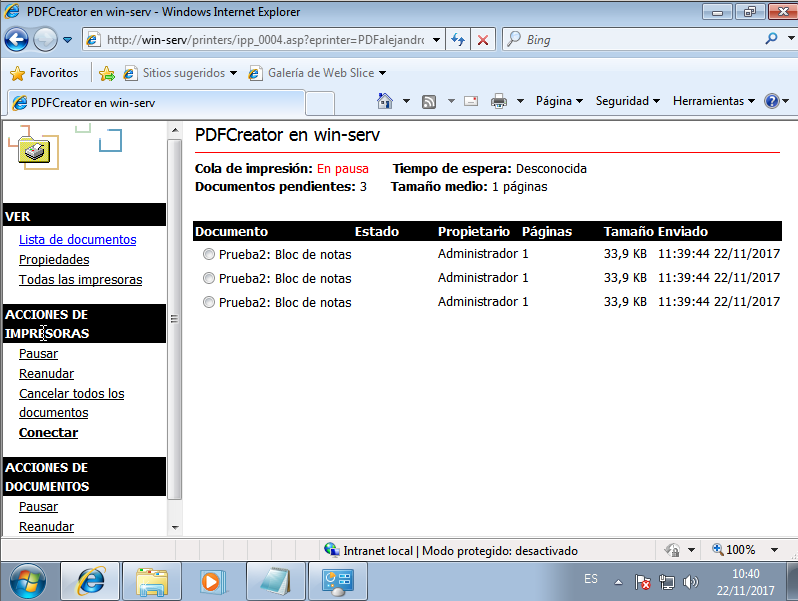
