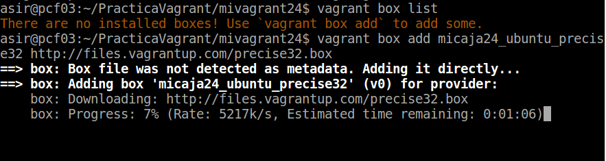
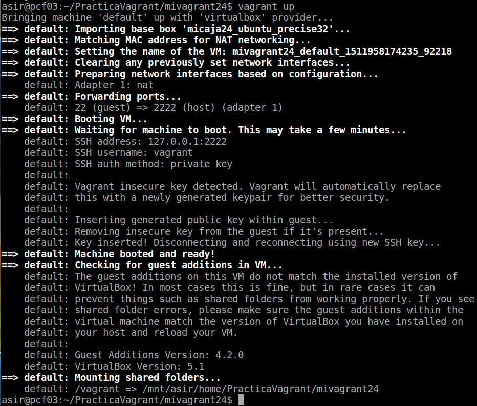
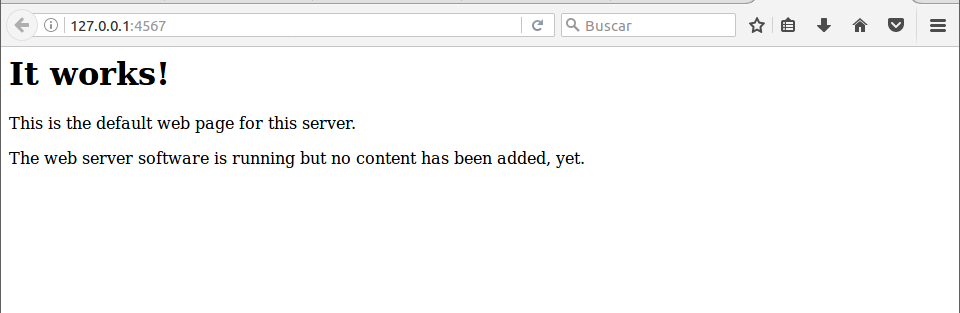
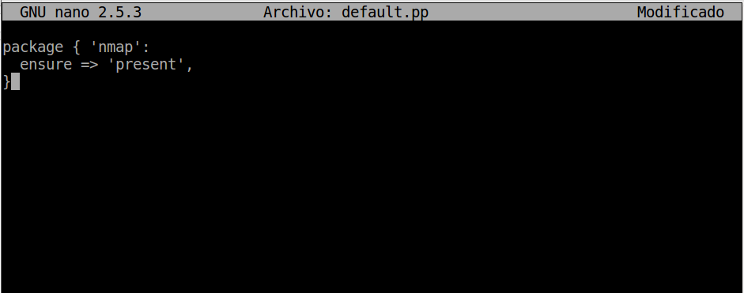
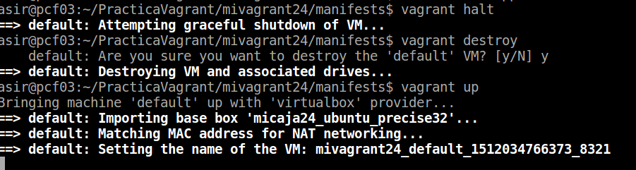
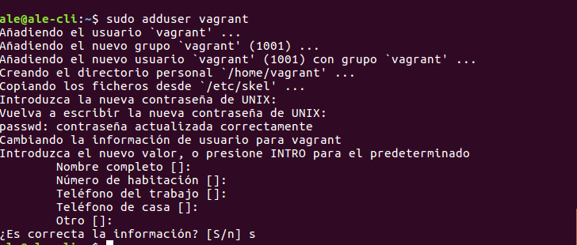
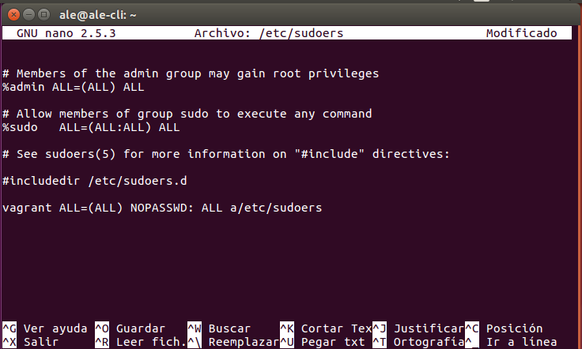
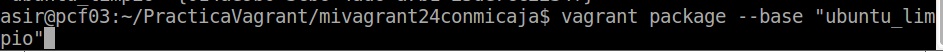
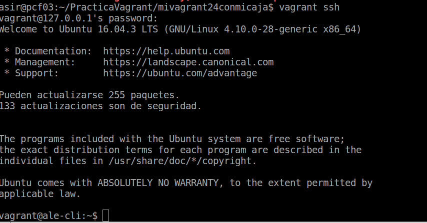

# Vagrant y VirtualBox

## 1 Primeros pasos

### 1.1 Creación del proyecto

* Creamos un directorio para nuestro proyecto vagrant

### 1.2 Generamos la imagen

* Ahora vamos a descargar una imagen de un SO `ubuntu precise 32 bits`

* Hacemos un `vagrant box list` para listar las cajas/imágenes disponibles actualmente en nuestra máquina.

* Para usar una caja determinada en nuestro proyecto, modificamos el fichero `Vagrantfile`

### 1.3 Iniciar una nueva máquina

* `vagrant up` es comando para iniciar una nueva instancia de la máquina.

* Con `vagrant ssh` entramos en nuestra máquina virtual usando SSH.

## 2 Configuración del entorno virtual

### 2.1 Carpetas sincronizadas

* Para identificar las carpetas compartidas dentro del entorno virtual, hacemos lo siguiente.

### 2.2 Redireccionamiento de los puertos

* Entramos en la MV e instalamos apache.

* Modificar el fichero `Vagrantfile`, de modo que el puerto 4567 del sistema anfitrión sea enrutado al puerto 80 del ambiente virtualizado.

* Luego iniciamos la MV (podemos usar `vagrant reload` si la máquina ya está encendida)

* Para confirmar que hay un servicio a la escucha en 4567, realizamos un `netstat -ntap`

* En la máquina real, abrimos el navegador web con el URL http://127.0.0.1:4567

## 3 Suministro

### 3.1 Suministro mediante shell script

* Crear el script `install_apache.sh` con el siguiente contenido

* Modificar Vagrantfile y agregar la siguiente línea a la configuración.

* Volvemos a crear la MV.

* Ahora abrimos navegador en la máquina real con URL http://127.0.0.1:4567

### 3.2 Suministro mediante Puppet

* Modificar el archivo el archivo Vagrantfile de la siguiente forma:

* Crear un fichero manifests/default.pp, con las órdenes/instrucciones puppet para instalar el programa nmap.

* Parar la MV, destruirla y crearla de nuevo (vagrant halt, vagrant destroy y vagrant up).

## 4 Nuestra caja personalizada

### 4.1 Preparar la MV VirtualBox

* Crear el usuario vagrant, para poder acceder a la máquina virtual por SSH.

* Creamos el directorio .SSH, donde nos descargamos la clave privada.

* Realizamos cambios en los permisos.

* Añadir vagrant ALL=(ALL) NOPASSWD: ALL a /etc/sudoers.

* Debemos asegurarnos que tenemos instalado las VirtualBox Guest Additions con una versión compatible con el host anfitrion.

### 4.2 Crear la caja vagrant

* Vamos a crear una nueva carpeta mivagrantXXconmicaja.

* Ejecutamos vagrant init para crear el fichero de configuración nuevo.

* Crear la caja package.box a partir de la MV.

* Finalmente, añado la nueva caja creada por mí al repositorio de vagrant.

* Faciendo vagrant ssh nos conectamos sin problemas con la máquina.

