# Docker

## 1. ¿Qué es Docker?

Docker es un proyecto de código abierto que automatiza el despliegue de aplicaciones dentro de contenedores de software, proporcionando una capa adicional de abstracción y automatización de Virtualización a nivel de sistema operativo en Linux.

## 2. Instalación y primeras pruebas

* Ejecutaremos como superusuario los siguientes comandos:

```console

zypper in docker

```
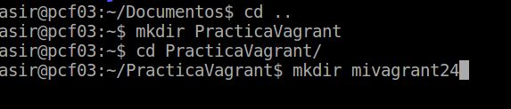

```console

sudo systemctl start docker

```
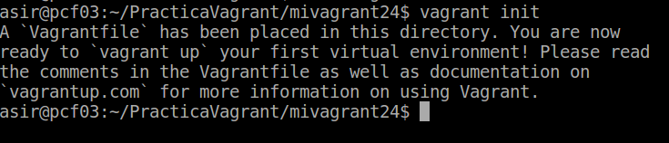
```console

sudo docker version

```
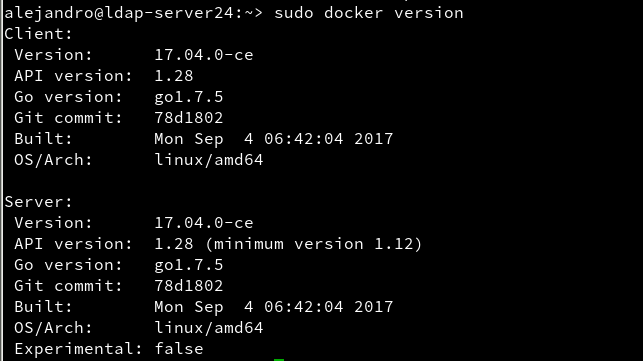
```console

sudo usermod -a -G docker USERNAME

```
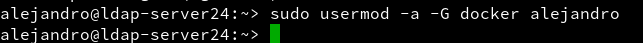

* Una vez realizados los anteriores comandos, realizamos ahora los siguientes con nuestro usuario:

```console

docker images

```
(Muestra las imágenes descargadas hasta ahora)

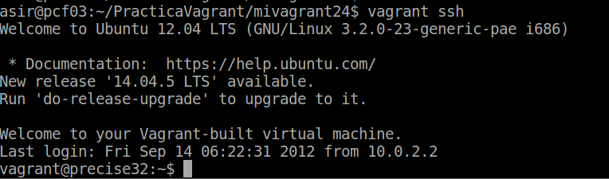

```console

docker ps -a

```
(Muestra todos los contenedores creados)

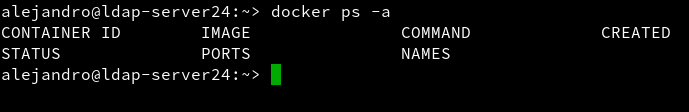

```console

docker run hello-world

```
(Descarga y ejecuta un contenedor con la imagen hello-world)

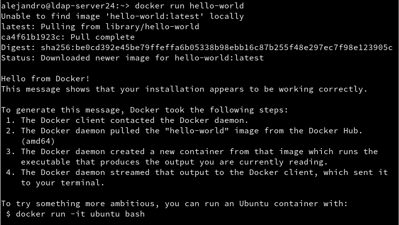

```console

docker images

```
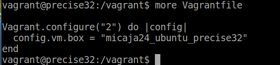

```console

docker ps -a

```

(El contenedor está estado 'Exited')


## 3. Configuración de la red

* Para que el contenedor tenga acceso a la red exterior debemos habilitar una opción denominada `FW_ROUTE`, localizada en el fichero `/etc/sysconfig/SuSEfirewall2` y cambiar su estado a "yes"

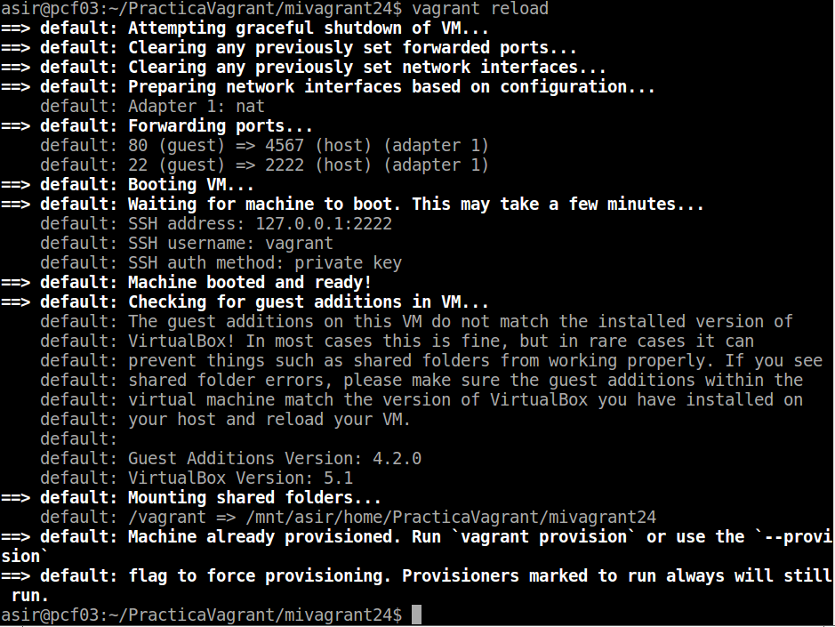

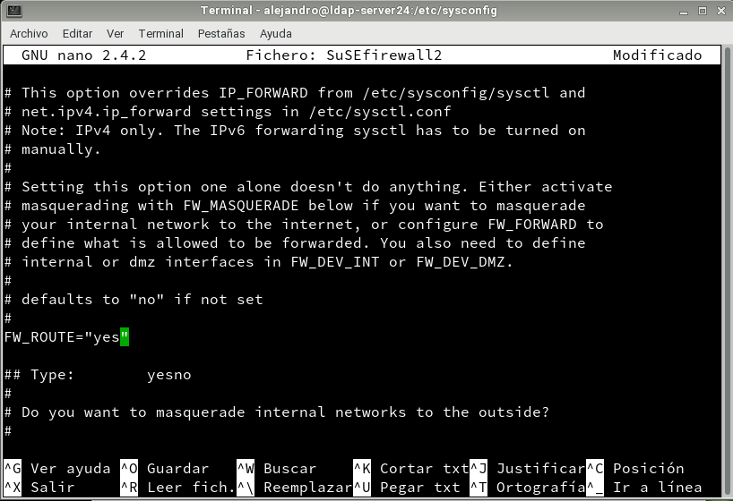

## 4. Creación manual

* Nuestro SO base es OpenSUSE, pero vamos a crear un contenedor Debian8, y dentro instalaremos Nginx.

### 4.1 Crear una imagen manualmente

```console

docker search debian

```
(Buscamos en los repositorios de Docker Hub)

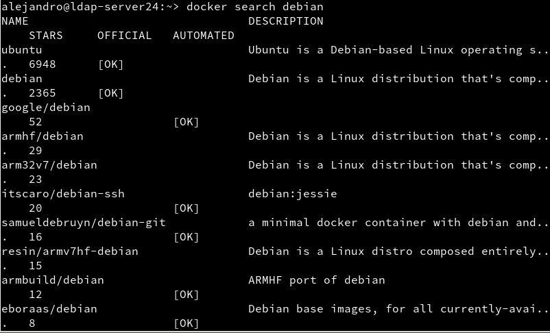
```console

docker pull debian:8

```
(Descargamos una imagen `debian:8` en local)

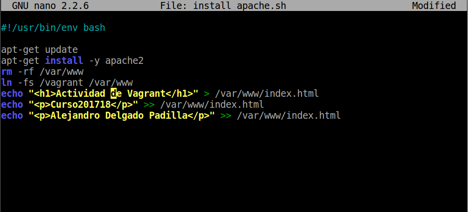
```console

docker ps -a

```
(Vemos todos los contenedores que tenemos)

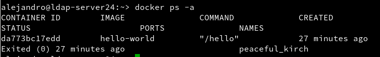

```console

docker ps

```
(Vemos sólo los contenedores en ejecución)


* Vamos a crear un contenedor con nombre `con_debian` a partir de la imagen `debian:8`, y ejecutaremos `/bin/bash`:

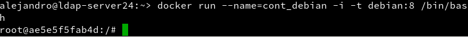

* Comprobamos que estamos en Debian

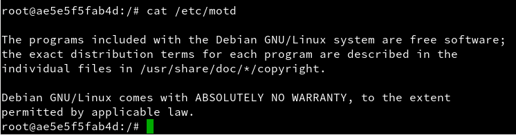

* Refrescamos los repositorios

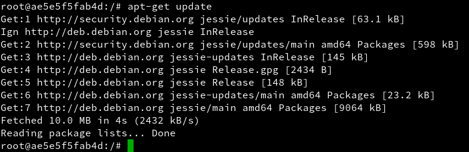

* Instalamos Nginx dentro del contenedor

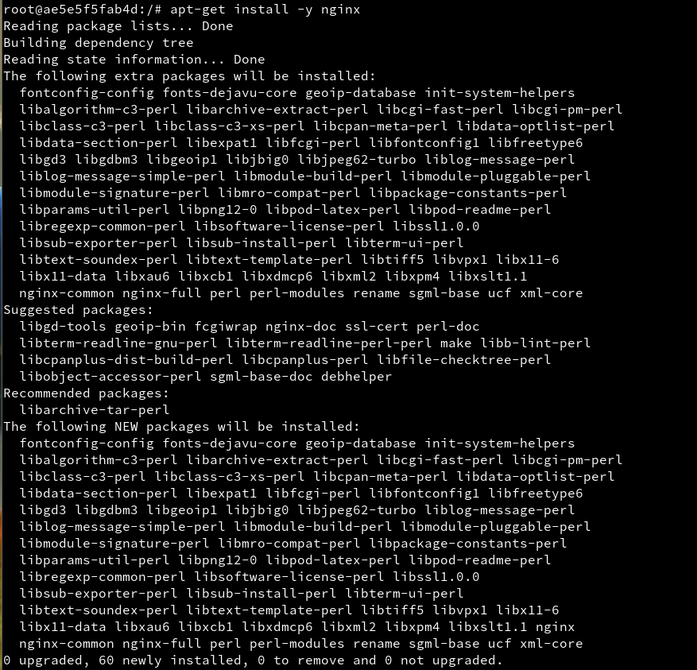

* Instalamos vi en el contenedor

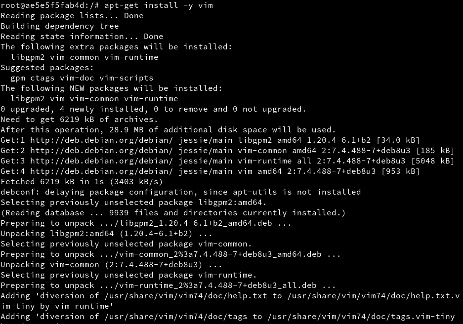

* Iniciamos Nginx

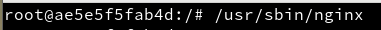

* Comprobamos que Nginx está iniciado y en funcionamiento

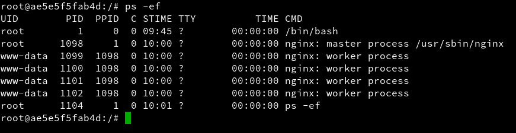

* Creamos un fichero `html` llamado `holamundo.html`

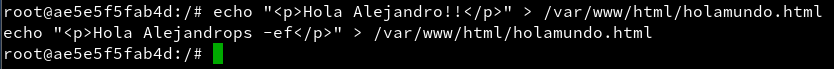

* Creamos tambien un script `/root/server.sh` con el siguiente contenido:

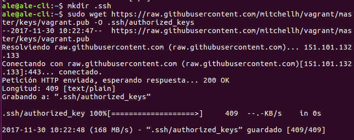

* Le ponemos permisos de ejecución al script

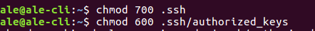

* Ya tenemos nuestro contenedor auto-suficiente de Nginx

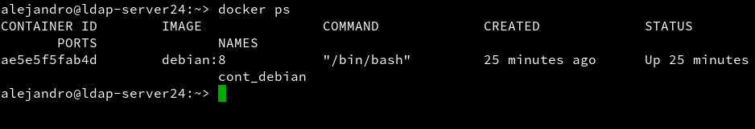

* Ahora con esto podemos crear la nueva imagen a partir de los cambios que realizamos sobre la imagen base

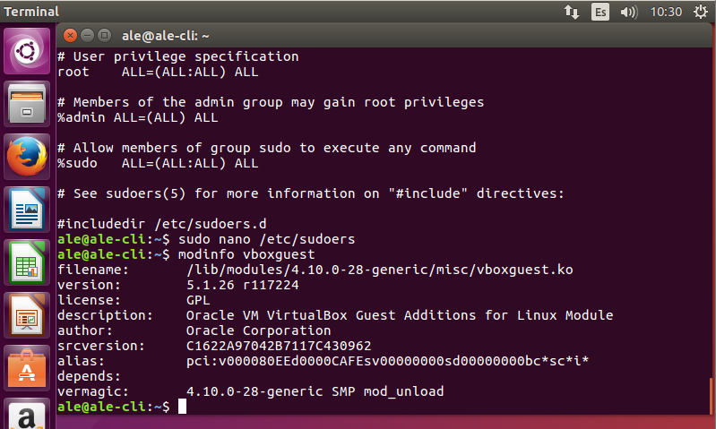

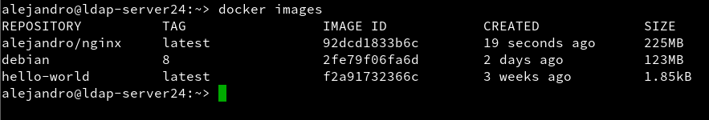

* Paramos el contenedor

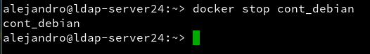

* Vemos el contenedor parado

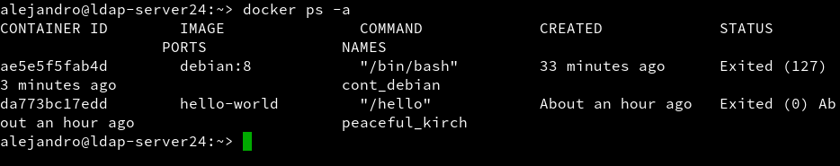

* Y lo eliminamos

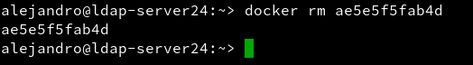

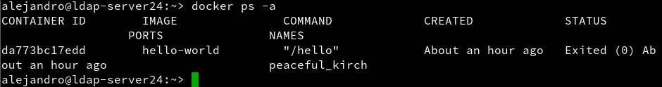

### 4.2 Crear contenedor con Nginx

* Iniciamos el contenedor de la siguiente forma:

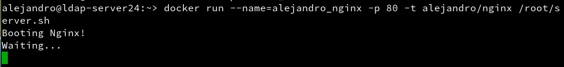

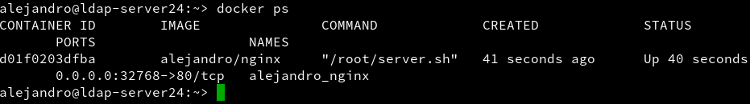

* docker ps nos muestra los contenedores en ejecución. Podemos apreciar que la última columna nos indica que el puerto 80 del contenedor está redireccionado a un puerto local. Abrir navegador web y poner URL 0.0.0.0.:NNNNNN. De esta forma nos conectaremos con el servidor Nginx que se está ejecutando dentro del contenedor

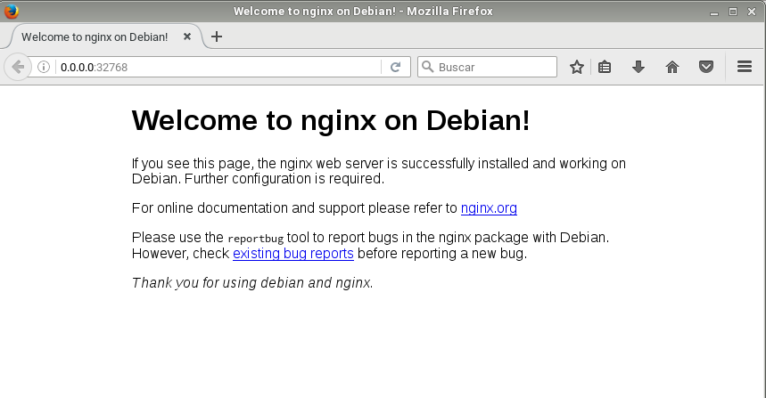

* Ahora paramos y eliminamos el contenedor

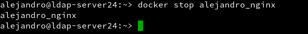

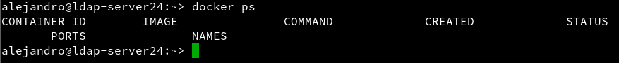

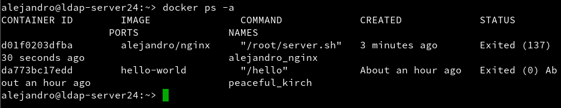

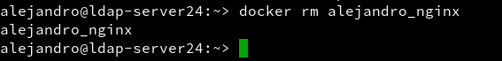

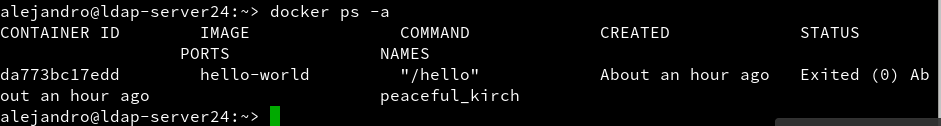

## 5. Crear contenedor con Dockerfile

* Creamos el directorio `/home/nombre-alumno/dockerXX`

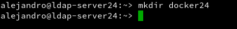

* Dentro creamos los ficheros Dockerfile, holamundo.html y server.sh

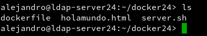

Contenido del fichero Dockerfile:

```console

FROM debian:8

MAINTAINER Alejandro 1.0

RUN apt-get update
RUN apt-get install -y apt-utils
RUN apt-get install -y nginx
RUN apt-get install -y vim

COPY holamundo.html /var/www/html
RUN chmod 666 /var/www/html/holamundo.html

COPY server.sh /root
RUN chmod +x /root/server.sh

EXPOSE 80

CMD ["/root/server.sh"]

```

* Ahora creamos la imagen desde el Dockerfile


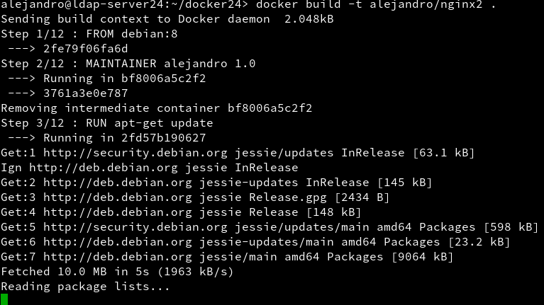

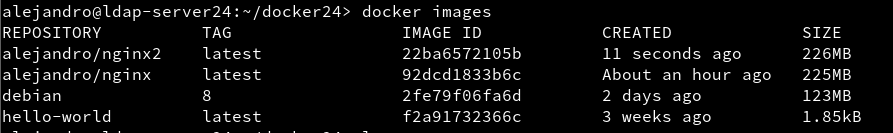

* Y con esto hecho, ya podemos crear el contenedor

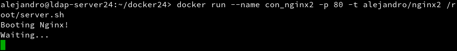

* Miramos de nuevo el puerto habilitado y hacemos la conexión

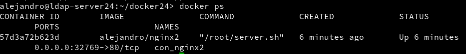

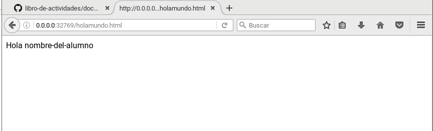

## 6. Migrar las imagenes desde docker a otro servidor

* Con el siguiente comando crearemos una imagen del contenedor que queremos exportar poniendo su ID

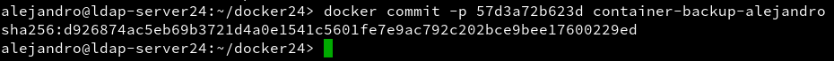

* Comprobamos que tenemos la imagen lista

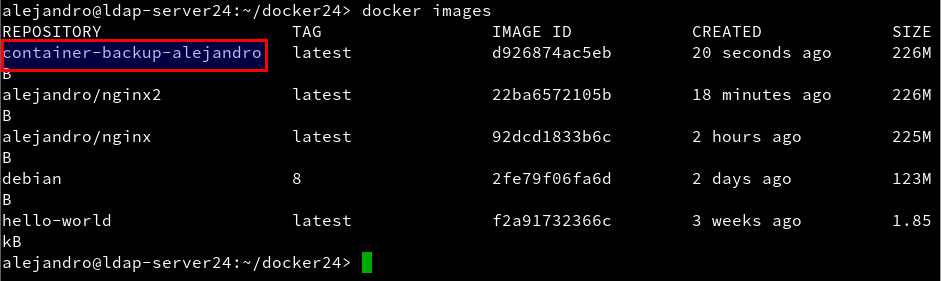

* Una vez hecho esto, guardamos la imagen en in fichero .tar y la guardamos en nuestro directorio home

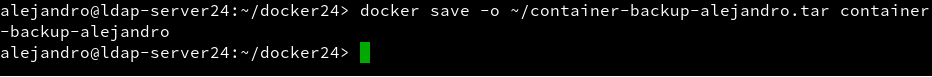

* Ya tenemos la imagen guardada en nuestro home

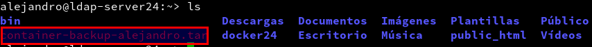

* Le pasamos dicho fichero a nuestro compañero, el cuál también nos pasará el suyo

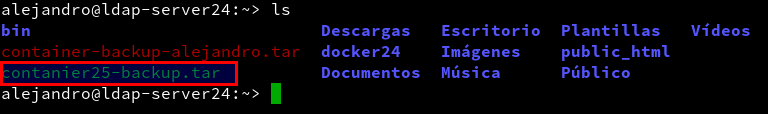

* Cargamos entonces la imagen que nos ha pasado nuestro compañero


* Vemos que está cargada lista para usarse


