# Puppet

## ¿Qué es Puppet?

* Puppet es una herramienta diseñada para administrar la configuración de sistemas Unix-like y de Microsoft Windows de forma declarativa. El usuario describe los recursos del sistema y sus estados, ya sea utilizando el lenguaje declarativo de Puppet o un DSL (lenguaje específico del dominio) de Ruby.

## Máquinas a utilizar

* MV1, que hará de master.

  -SO: OpenSUSE

  -IP: 172.18.24.100

  -Nombre del equipo: master24

  -Dominio: Curso1718

* MV2, primer cliente.

  -SO: OpenSUSE

  -IP: 172.18.24.101

  -Nombre del equipo: cli1alu24

  -Dominio: Curso1718

* MV3, segundo cliente.

  -SO: Windows 7

  -IP: 172.18.24.102

  -Nombre del equipo: cli2alu24

  -Dominio: Curso1718

----

----

## 1. Instalación y configuración del servidor

* Instalamos `Puppet Master` en la MV1 (master24)

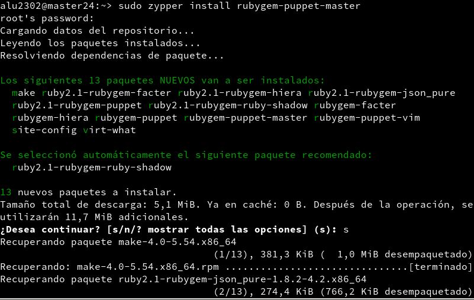

* Preparamos el siguiente esquema de directorios:

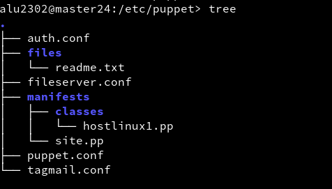

### 1.1 site.pp

* site.pp es nuestro principal fichero de configuración para configurar el resto de agentes de Puppet

El contenido de dicho fichero debe ser el siguiente:

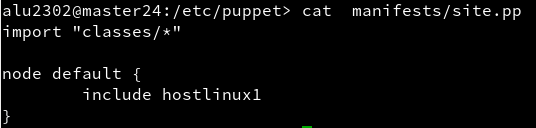

### 1.2 hostlinux.pp

* Las configuraciones de cada uno de los agentes las vamos a guardar en diferentes ficheros en la ruta `/etc/puppet/manifests/classes/`

El contenido de nuestro primer fichero, destinado al primero cliente es el siguiente:

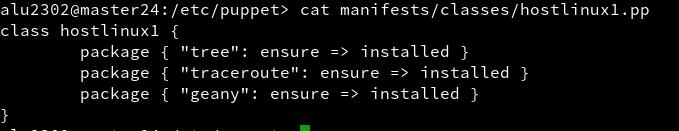

### 1.3 Últimas comprobaciones

* Comprobamos que el directorio `/var/lib/puppet` tiene como propietario a `puppet`

(NUEVAIMAGEN)

* Reiniciamos el servicio


* Comprobamos que el servicio está en funcionamiento

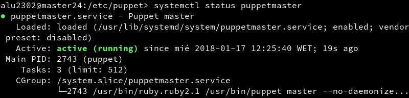

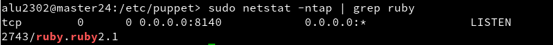

## 2. Instalación y configuración del cliente1

* En la MV2 (cli1alu24) instalamos el agente puppet

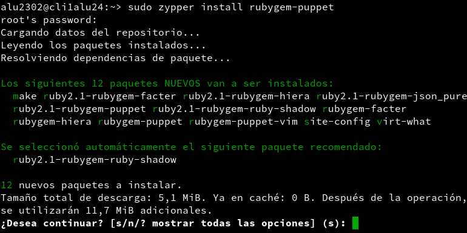

* El cliente tiene que saber cuál es el equipo que va a actuar de master, así que se lo comunicamos mediante el fichero `/etc/puppet/puppet.conf`

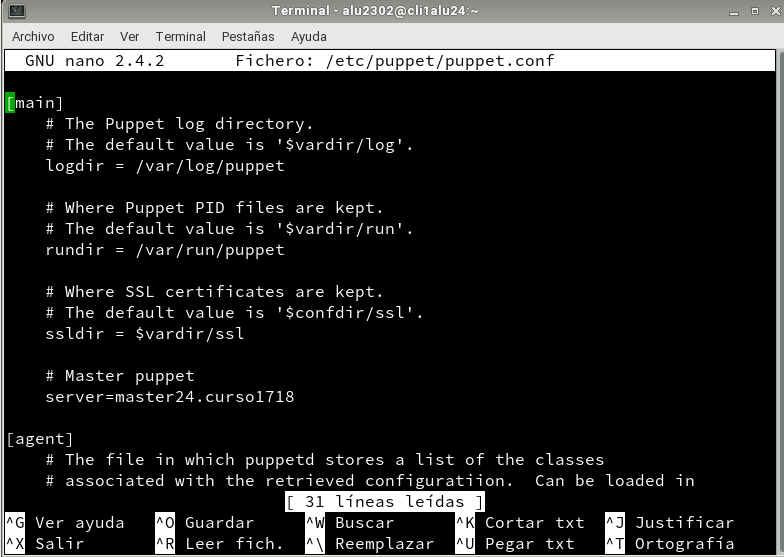

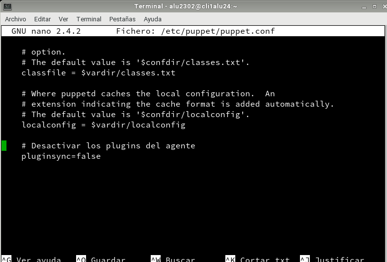

* Hemos introducido las siguientes líneas:

```console

[main]
server = master24.curso1718 # Señala quien es el equipo "master"

[agent]
pluginsync = false # Desactiva los plugins para este agente

```

* Comprobamos que el directorio `/var/lib/puppet` tiene como propietario a puppet

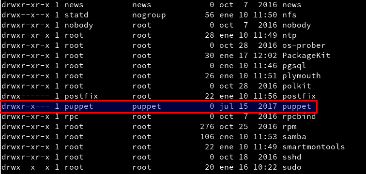

* Arrancamos el servicio y comprobamos que funciona correctamente

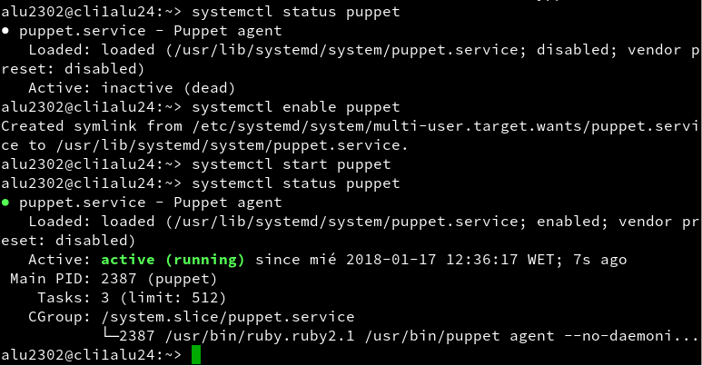

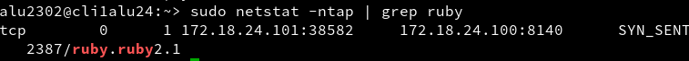

## 3. Certificados

* El cliente, a sabiendas de quién es el equipo master, le enviará su certificado para que éste lo valide como agente puppet.

### 3.1 Aceptación del certificado

* En la máquina master nos logueamos como usuario root y ejecutamos el comando `puppet cert list` para ver las peticiones de los clientes

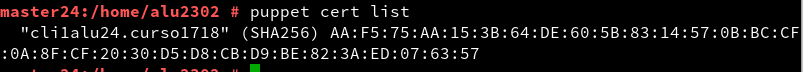

* Para "agregar" al equipo, lo que hacemos es ejecutar `puppet sign` y el nombre de la máquina en cuestión.

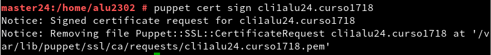

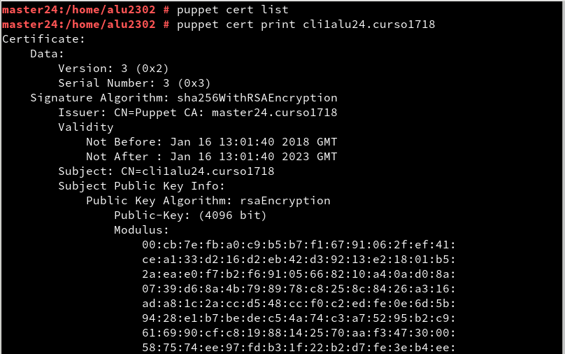

### 3.2 Comprobación

* Reiniciamos el servicio puppet

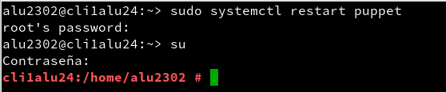

* Ejecutamos los siguientes comandos para forzar la ejecución del agente puppet

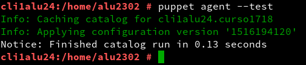

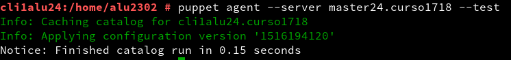

## 4. Segunda versión del fichero .pp

* Como el propio título dicta, vamos a añadirle una segunda configuración más completa a la MV2, asi que creamos un segundo fichero de configuración `hostlinux2.pp`

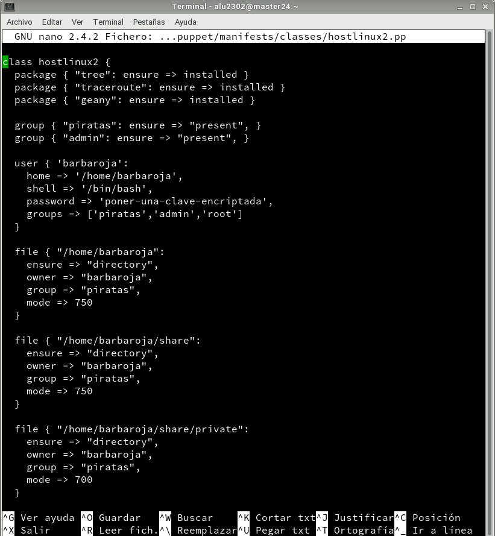

* Ahora en `site.pp` indicamos que tire de la configuración de dicho fichero

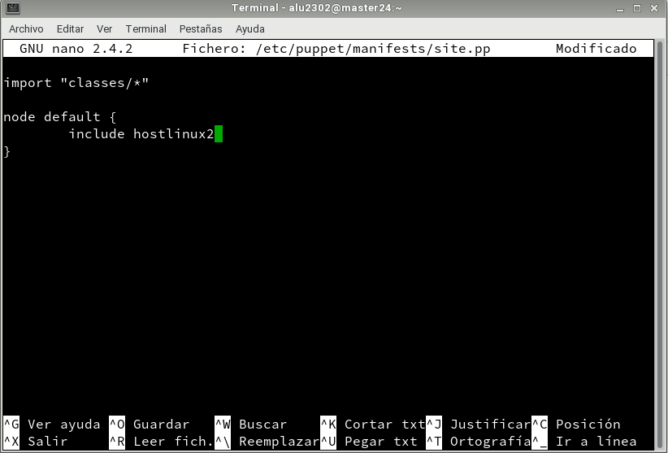

* Hacemos un tree del directorio `puppet`


### 4.1 Comprobación

- Comprobación de instalación de los programas designados:

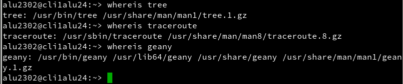

- Comprobación de los grupos generados:


- Comprobación del usuario creado `barbaroja`:

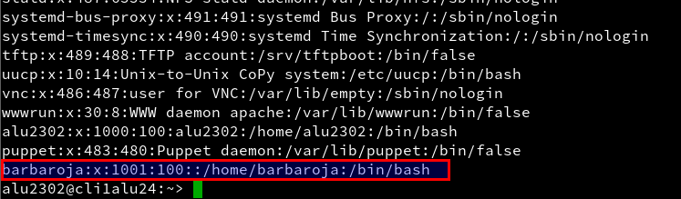

- Comprobación de los directorios creados:

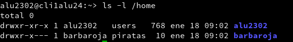

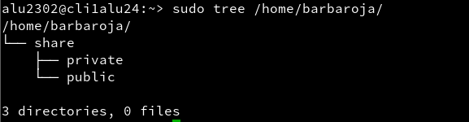

## 5. Cliente puppet Windows

* Nos vamos de nuevo a la MV1 (master24), desde donde crearemos el nuevo fichero de configuración para la MV3 con SO Windows

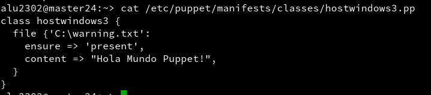

* Luego en el `site.pp` agregamos al host `windows`

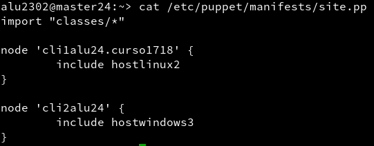

* Hacemos un tree del directorio `/etc/puppet`

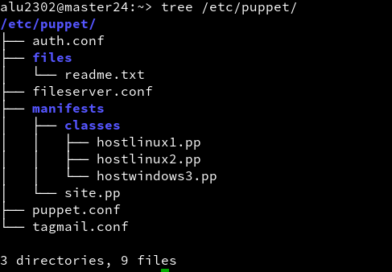

* Reiniciamos el servicio de `puppetmaster`


* Ejecutamos el comando `facter` en el master para saber la versión de puppet que estamos usando


### 5.1 Instalación del cliente puppet en Windows

* A sabiendas de la versión de puppet que tenemos en el master, vamos al enlace https://downloads.puppetlabs.com/windows/ y descargamos la versión correspondiente

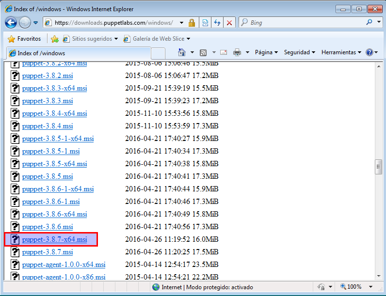

* Realizamos la instalación a través del asistente

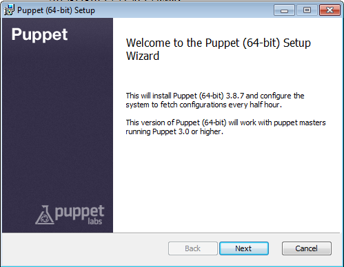

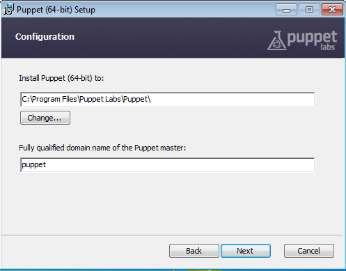

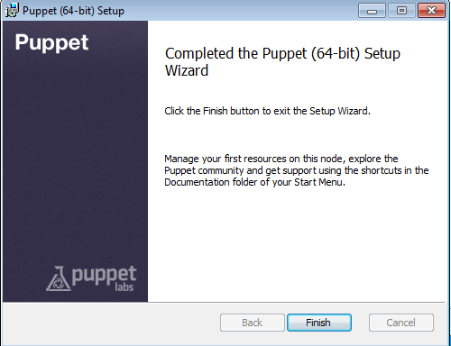

* Modificamos el fichero `C:\ProgramData\PuppetLabs\puppet\etc\puppet.conf` que es el que le indicará al cliente quién es su master

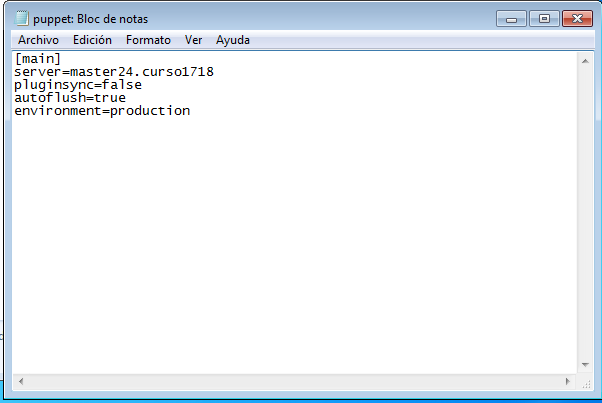

* Una vez hecho esto ya deberíamos recibir el certificado en el master

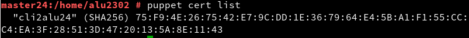

* Lo agregamos

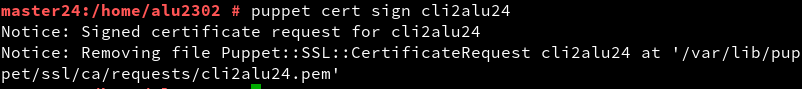

### 5.2 Comprobamos los cambios

* Vamos al cliente, donde iniciamos la consola de puppet como administrador

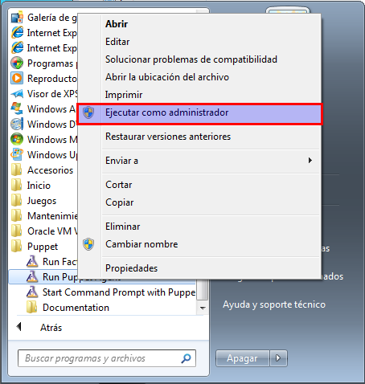

* Y ahora ejecutamos los siguientes comandos:

```console

puppet agent --configprint server #muestra el nombre del servidor puppet

```

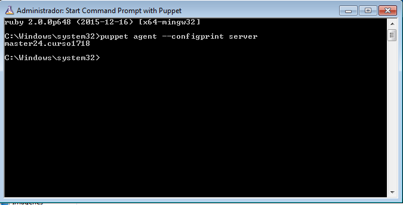
