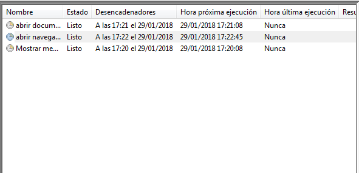
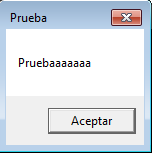

# Tareas programadas en Windows y Linux

## Windows

* Para generar las tareas programadas en windows primero debemos acceder al panel de control

* Una vez allí, accedemos a `herramientas administrativas`

* Y por último seleccionamos el `programador de tareas`

### Tarea diferida Windows

* Vamos a crear una tarea diferida, como puede ser mostrar un mensaje en pantalla. Para ello seleccionamos `crear tarea`

* Accedemos a la pestaña `desencadenadores` y elegimos una hora concreta

* Luego le indicamos cual va a ser la acción a realizar

* Una vez hecho eso le damos a `aceptar` y esperamos. Mientras tanto se pueden ver las tareas diseñadas y las horas de ejecución entre otra información

* El mensaje que nos sale finalmente

### Tarea periódica Windows

* Ahora vamos a crear una tarea diferida. En nuestro caso va a ser a partir de un sencillo script para apagar el equipo

* Le ponemos nombre a la tarea

* Marcamos que la tarea sea diaria y la hora a la que se debe activar

* Y por último indicamos cuál es la aplicación que se debe ejecutar y validamos la orden pulsando en `finalizar`

* Aquí de nuevo observamos que la orden está en espera

* Y termina ejecutándose

## Linux

### Tarea diferida Linux

* Debemos comprobar que el servicio `atd` esté activo

* En en gesto de servicios de `yast` vemos que está activado y habilitado al inicio

* Utilizando el comando `atq` podemos comprobar si hay tareas en espera (queue)

* Comprobamos que no es así, de modo que vamos a hacer una prueba. En nuestro caso, ejecutará el siguiente script

* Una vez hecho esto, tenemos que ejecutar el comando `at` indicándole la hora a la que debe ejecutarse la tarea y el fichero que debe ejecutar

* Una vez pasado el tiempo de espera, ejecutamos `at` de nuevo para ver el resultado

### Tarea periódica Linux

* Para realizar esta tarea periodica usaremos el comando `crontab`. Antes que nada, haremos un `crontab -l` para comprobar que no hay tareas programadas

* Una vez comprobado esto, con el comando `crontab -e` abrimos el editor de `crontab`, que por defecto utiliza el editor `vim`

 Ahí es donde generaremos el siguiente script

* Ahora realizamos un `crontab -l` de nuevo y observamos que la tarea ya está creada

* Y por último vemos que se ha ejecutado satisfactoriamente

